# CAD - Backward Compatibility Strategy

**Generated**: 2025-11-03 06:05 CST  
**Parent**: `WARP.md`  
**Status**: 🔄 Architecture Design

---

## 🎯 Problem Statement

### Current Challenge

El ecosistema CAD actual (342 componentes) usa **tecnologías obsoletas** para comunicación:

| Legacy Tech | Current Use | Issue |
|-------------|-------------|-------|
| **Avaya JTAPI** | Telephony integration | Proprietary, no E2E encryption |
| **WebSockets (Redis)** | Real-time messaging | Centralized, no P2P |
| **VXG Video** | Video streaming (26 servers) | Centralized infrastructure |
| **ms-grabacion-oreka** | Call recording | No cryptographic integrity |

### Future Standards

Tecnologías emergentes que **deben adoptarse**:

| Standard | Type | Status |
|----------|------|--------|
| **WebRTC** | P2P audio/video | ✅ Mature (RFC 8854) |
| **Matrix Protocol** | Federated messaging | ✅ Production (Element, etc.) |
| **Signal Protocol** | E2E encryption | ✅ Battle-tested |
| **Jitsi Meet** | P2P video conferencing | ✅ Open source |
| **SIP over TLS** | VoIP standard | ✅ RFC 3261 + TLS |

### User Question

> "¿Cómo crear el sistema para que **acepte estándares por ser adoptados** y tenga **retrocompatibilidad con tecnología obsoleta**?"

---

## 🏗️ Solution Architecture: Adapter Layer Pattern

```mermaid
graph TB
    subgraph "BSV Blockchain Layer"
        TERANODE[Teranode Network]
        MSGBOX[Message Box P2P]
        IDENTITY[Identity Services DID]
    end
    
    subgraph "Adapter Layer (Backward Compat)"
        TELEPHONY_ADAPTER[Telephony Adapter]
        VIDEO_ADAPTER[Video Adapter]
        MESSAGING_ADAPTER[Messaging Adapter]
    end
    
    subgraph "Legacy Systems (Obsolete)"
        AVAYA[Avaya JTAPI]
        VXG[VXG Video 26 servers]
        REDIS_WS[WebSocket Redis]
        OREKA[Oreka Call Recorder]
    end
    
    subgraph "Modern Standards (Future)"
        WEBRTC[WebRTC P2P]
        MATRIX[Matrix Protocol]
        SIGNAL[Signal Protocol E2E]
        JITSI[Jitsi Meet]
        SIP_TLS[SIP over TLS]
    end
    
    subgraph "Client Applications"
        DISPATCHER[Dispatcher Wallet UI]
        FIELD_UNIT[Field Unit Wallet]
        CITIZEN[Citizen App]
    end
    
    %% Connections: Modern Clients → BSV
    DISPATCHER -->|native| MSGBOX
    FIELD_UNIT -->|native| MSGBOX
    CITIZEN -->|native| MSGBOX
    
    %% Connections: Adapter Layer → BSV
    TELEPHONY_ADAPTER -->|log to blockchain| TERANODE
    VIDEO_ADAPTER -->|anchor to UHRP| TERANODE
    MESSAGING_ADAPTER -->|mirror events| MSGBOX
    
    %% Connections: Adapter Layer → Legacy
    TELEPHONY_ADAPTER -.bridge.-> AVAYA
    TELEPHONY_ADAPTER -.bridge.-> OREKA
    VIDEO_ADAPTER -.proxy.-> VXG
    MESSAGING_ADAPTER -.relay.-> REDIS_WS
    
    %% Connections: Adapter Layer → Modern Standards
    TELEPHONY_ADAPTER -->|native| WEBRTC
    TELEPHONY_ADAPTER -->|fallback| SIP_TLS
    VIDEO_ADAPTER -->|native| JITSI
    VIDEO_ADAPTER -->|E2E| SIGNAL
    MESSAGING_ADAPTER -->|native| MATRIX
    
    %% All events logged to blockchain
    TELEPHONY_ADAPTER -.audit trail.-> IDENTITY
    VIDEO_ADAPTER -.audit trail.-> IDENTITY
    MESSAGING_ADAPTER -.audit trail.-> IDENTITY
```



---

## 📐 Design Principles

### 1. **Progressive Enhancement**

Clientes modernos obtienen **funcionalidades avanzadas** sin afectar legacy:

```typescript
// Modern client (WebRTC P2P)
interface ModernCall {
  protocol: 'webrtc'
  e2eEncryption: true
  p2p: true
  blockchainLogged: true
  did: string  // caller DID
}

// Legacy client (Avaya bridge)
interface LegacyCall {
  protocol: 'avaya-jtapi'
  e2eEncryption: false  // ⚠️ centralized
  p2p: false
  blockchainLogged: true  // ✅ adapter logs to blockchain
  phoneNumber: string  // PSTN number
}
```

**Key**: Adapter **siempre registra en blockchain**, independiente del protocolo origen.

### 2. **Protocol Negotiation**

Clientes negocian mejor protocolo disponible:

```typescript
class CallNegotiator {
  async initiateCall(from: DID, to: DID): Promise<CallSession> {
    const capabilities = await this.queryCapabilities(to)
    
    // Try modern protocols first (best to worst)
    if (capabilities.webrtc) {
      return this.createWebRTCCall(from, to)  // P2P, E2E encrypted
    } else if (capabilities.sipTls) {
      return this.createSIPCall(from, to)  // VoIP with TLS
    } else if (capabilities.avaya) {
      return this.bridgeToAvaya(from, to)  // Legacy fallback
    } else {
      throw new Error('No compatible protocol')
    }
  }
}
```

### 3. **Audit Trail Normalization**

Todos los protocolos **se normalizan** antes de escribir a blockchain:

```typescript
interface NormalizedCallEvent {
  txid: string  // blockchain transaction ID
  type: 'call_initiated' | 'call_answered' | 'call_ended'
  timestamp: Date
  callerDID: string
  calleeDID: string
  protocol: 'webrtc' | 'sip-tls' | 'avaya' | 'pstn'
  duration: number
  e2eEncrypted: boolean
  contentHash: string  // SHA256 of call metadata
  recordingUHRP?: string  // if recorded
}
```

**Benefit**: Queries/analytics funcionan **independiente del protocolo** usado.

---

## 🔌 Component-by-Component Strategy

### 1️⃣ Telephony Adapter

#### Current Stack (Legacy)

```yaml
Legacy:
  - Avaya JTAPI (proprietary Java library)
  - ms-grabacion (recording service)
  - ms-grabacion-oreka (Oreka integration)
  - telefonia-durango, telefonia-jalis (regional)
```

#### Adapter Architecture

```typescript
class TelephonyAdapter {
  // Modern protocols (native support)
  private webrtcGateway: WebRTCGateway
  private sipTlsGateway: SIPTLSGateway
  
  // Legacy bridges
  private avayaBridge: AvayaJTAPIBridge
  private orekaBridge: OrekaRecorderBridge
  
  // Blockchain audit
  private blockchainLogger: TeranodeLogger
  
  async handleIncomingCall(event: IncomingCallEvent) {
    // 1. Determine source protocol
    const protocol = this.detectProtocol(event)
    
    // 2. Normalize to unified call object
    const normalizedCall = this.normalize(event, protocol)
    
    // 3. Log to blockchain (immutable audit)
    const txid = await this.blockchainLogger.logEvent({
      type: 'call_initiated',
      call: normalizedCall,
      timestamp: new Date()
    })
    
    // 4. Route to dispatcher
    await this.routeToDispatcher(normalizedCall, txid)
  }
  
  async initiateCall(from: DID, to: DID | PhoneNumber) {
    // If "to" is a DID, try modern protocols first
    if (isDID(to)) {
      const capabilities = await this.queryDIDCapabilities(to)
      if (capabilities.webrtc) {
        return this.createWebRTCCall(from, to)
      }
    }
    
    // Fallback to legacy (PSTN via Avaya)
    return this.bridgeToAvaya(from, to)
  }
}
```

#### Migration Timeline

| Phase | Duration | Action | Legacy Support |
|-------|----------|--------|----------------|
| **1. Adapter Deploy** | 1 month | Deploy adapter alongside legacy | ✅ 100% (bridge mode) |
| **2. Modern Client Rollout** | 3 months | Issue DIDs to dispatchers, enable WebRTC | ✅ 100% (dual mode) |
| **3. Partial Deprecation** | 6 months | Remove region-specific services (telefonia-durango) | ✅ 80% (critical paths only) |
| **4. Full Deprecation** | 12 months | Decommission Avaya entirely | ⚠️ 0% (emergency-only bridge) |

---

### 2️⃣ Video Adapter

#### Current Stack (Legacy)

```yaml
Legacy:
  - VXG Video (26 servers: 10.10.11.17-43)
  - ms-int-cinsight (C-Insight analytics)
  - ms-int-dahua (Dahua cameras)
  - Ms-Camaras (camera management)
  - ms-multimedia (multimedia service)
```

#### Adapter Architecture

```typescript
class VideoAdapter {
  // Modern protocols
  private jitsiGateway: JitsiMeetGateway
  private webrtcStreaming: WebRTCStreamingGateway
  
  // Legacy proxies
  private vxgProxy: VXGVideoProxy
  private cinsightProxy: CInsightProxy
  
  // Blockchain anchoring
  private uhrpClient: UHRPClient
  private blockchainLogger: TeranodeLogger
  
  async streamCamera(cameraId: string, viewer: DID) {
    // 1. Fetch camera metadata (from legacy DB or blockchain)
    const camera = await this.getCameraMetadata(cameraId)
    
    // 2. Check viewer authorization (sCrypt access control)
    const authorized = await this.checkAccess(camera, viewer)
    if (!authorized) throw new Error('Unauthorized')
    
    // 3. Determine best protocol
    const viewerCapabilities = await this.queryDIDCapabilities(viewer)
    
    if (viewerCapabilities.webrtc) {
      // Modern: P2P WebRTC stream
      return this.streamViaWebRTC(camera, viewer)
    } else {
      // Legacy: Proxy through VXG
      return this.proxyViaVXG(camera, viewer)
    }
  }
  
  async recordIncident(incidentId: string, streams: CameraStream[]) {
    // 1. Record to temporary storage (VXG or local)
    const recording = await this.recordStreams(streams)
    
    // 2. Upload to UHRP (content-addressed, immutable)
    const uhrpHash = await this.uhrpClient.upload(recording)
    
    // 3. Anchor to blockchain
    const txid = await this.blockchainLogger.logEvent({
      type: 'evidence_recorded',
      incidentId,
      uhrpHash,
      streams: streams.map(s => s.cameraId),
      timestamp: new Date()
    })
    
    // 4. Create sCrypt access control contract
    await this.createEvidenceContract({
      uhrpHash,
      requiredSignatures: 3,  // 3-of-5 multisig
      authorizedPubkeys: [supervisor, chief, DA, judge, IA]
    })
    
    return { uhrpHash, txid }
  }
}
```

#### Migration Timeline

| Phase | Duration | Action | Legacy Support |
|-------|----------|--------|----------------|
| **1. UHRP Integration** | 2 months | Upload new evidence to UHRP + VXG (dual-write) | ✅ 100% |
| **2. Historical Migration** | 6 months | Re-upload 1TB+ historical video to UHRP | ✅ 100% (VXG read-only) |
| **3. WebRTC Rollout** | 3 months | Enable P2P streaming for modern clients | ✅ 100% (dual streaming) |
| **4. VXG Deprecation** | 6 months | Decommission 26 VXG servers | ⚠️ Emergency-only backup |

---

### 3️⃣ Messaging Adapter

#### Current Stack (Legacy)

```yaml
Legacy:
  - websocket (WebSocket service)
  - ms-adapter-websocket (WebSocket adapter)
  - ms_websocket_redis (Redis-backed WebSocket)
  - mensajería (messaging service)
```

#### Adapter Architecture

```typescript
class MessagingAdapter {
  // Modern protocols
  private matrixClient: MatrixClient
  private messageBoxClient: MessageBoxClient
  
  // Legacy bridge
  private redisWsBridge: RedisWebSocketBridge
  
  // Blockchain audit
  private blockchainLogger: TeranodeLogger
  
  async sendMessage(from: DID, to: DID, content: string) {
    // 1. Check recipient capabilities
    const toCapabilities = await this.queryDIDCapabilities(to)
    
    // 2. Encrypt message (Signal Protocol if supported)
    const encrypted = await this.encryptMessage(content, to, toCapabilities)
    
    // 3. Send via best protocol
    if (toCapabilities.messageBox) {
      // Modern: P2P via Message Box
      await this.messageBoxClient.send(from, to, encrypted)
    } else if (toCapabilities.matrix) {
      // Federated: via Matrix
      await this.matrixClient.send(from, to, encrypted)
    } else {
      // Legacy: bridge to Redis WebSocket
      await this.redisWsBridge.send(from, to, encrypted)
    }
    
    // 4. Log to blockchain (hash only, not content)
    await this.blockchainLogger.logEvent({
      type: 'message_sent',
      from,
      to,
      contentHash: sha256(content),
      timestamp: new Date()
    })
  }
  
  async subscribeToMessages(userDID: DID, callback: MessageCallback) {
    // Listen on ALL protocols (modern + legacy)
    await Promise.all([
      this.messageBoxClient.subscribe(userDID, callback),
      this.matrixClient.subscribe(userDID, callback),
      this.redisWsBridge.subscribe(userDID, callback)
    ])
  }
}
```

#### Migration Timeline

| Phase | Duration | Action | Legacy Support |
|-------|----------|--------|----------------|
| **1. Message Box Deploy** | 1 month | Deploy alongside Redis WebSocket | ✅ 100% (dual-listen) |
| **2. Modern Client Rollout** | 3 months | Dispatchers use Message Box + Matrix | ✅ 100% (broadcast to both) |
| **3. Legacy Sunset** | 6 months | Remove Redis WebSocket | ✅ 50% (critical only) |
| **4. Full P2P** | 12 months | 100% P2P messaging (no central server) | ⚠️ Emergency bridge only |

---

## 🧪 Testing Strategy

### Dual-Protocol Testing

```typescript
describe('Telephony Adapter - Protocol Negotiation', () => {
  it('should prefer WebRTC over legacy', async () => {
    const from = createMockDID('dispatcher-001')
    const to = createMockDID('field-unit-042')
    
    // Mock: "to" supports WebRTC
    mockDIDCapabilities(to, { webrtc: true, avaya: true })
    
    const call = await adapter.initiateCall(from, to)
    
    expect(call.protocol).toBe('webrtc')
    expect(call.e2eEncrypted).toBe(true)
  })
  
  it('should fallback to Avaya for legacy clients', async () => {
    const from = createMockDID('dispatcher-001')
    const to = '+525512345678'  // PSTN number
    
    const call = await adapter.initiateCall(from, to)
    
    expect(call.protocol).toBe('avaya')
    expect(call.blockchainLogged).toBe(true)  // still audited
  })
})
```

### Integration Tests (End-to-End)

```bash
# Test: Modern client → Legacy client (protocol downgrade)
npm run test:integration:call-webrtc-to-avaya

# Test: Legacy camera → Modern viewer (protocol upgrade)
npm run test:integration:vxg-to-webrtc

# Test: Blockchain audit trail (all protocols)
npm run test:integration:audit-trail
```

---

## 📊 Rollout Metrics

### Success Criteria

| Metric | Target | Current (Legacy) | Measurement |
|--------|--------|------------------|-------------|
| **Call Success Rate** | 99.9% | 95% | Calls completed / total calls |
| **P2P Call Ratio** | 80% | 0% | WebRTC calls / total calls |
| **Video Latency** | <100ms | ~500ms (VXG proxy) | P2P vs centralized |
| **Evidence Immutability** | 100% | 0% | UHRP anchored / total evidence |
| **Adapter Availability** | 99.95% | N/A | Uptime monitoring |

### Rollback Plan

En caso de falla crítica del adapter:

```yaml
Rollback Steps:
  1. Route 100% traffic to legacy systems (Avaya, VXG, Redis)
  2. Disable adapter in Kubernetes (scale to 0 replicas)
  3. Notify engineering team via PagerDuty
  4. Post-mortem within 24 hours
  
Max Rollback Time: 5 minutes
Data Loss: 0 (dual-write to legacy + blockchain)
```

---

## 🛠️ Implementation Roadmap

### Phase 1: Adapter Framework (Month 1)

```typescript
// File: src/adapters/base-adapter.ts
abstract class BaseAdapter {
  protected blockchainLogger: TeranodeLogger
  protected didResolver: DIDResolver
  
  abstract handleLegacyEvent(event: LegacyEvent): Promise<void>
  abstract handleModernEvent(event: ModernEvent): Promise<void>
  
  async logToBlockchain(event: NormalizedEvent): Promise<string> {
    return this.blockchainLogger.logEvent(event)
  }
}

// File: src/adapters/telephony-adapter.ts
class TelephonyAdapter extends BaseAdapter { /* ... */ }

// File: src/adapters/video-adapter.ts
class VideoAdapter extends BaseAdapter { /* ... */ }

// File: src/adapters/messaging-adapter.ts
class MessagingAdapter extends BaseAdapter { /* ... */ }
```

**Deliverables**:
- ✅ Base adapter framework
- ✅ Blockchain logger integration
- ✅ DID resolver integration
- ✅ Unit tests (80% coverage)

### Phase 2: Legacy Bridges (Months 2-3)

```typescript
// File: src/bridges/avaya-bridge.ts
class AvayaJTAPIBridge {
  async bridgeCall(call: ModernCall): Promise<AvayaCall> {
    // Convert WebRTC SDP → Avaya JTAPI commands
    const avayaCall = await this.avayaClient.makeCall(call.to)
    return avayaCall
  }
}

// File: src/bridges/vxg-proxy.ts
class VXGVideoProxy {
  async proxyStream(camera: CameraMetadata): Promise<StreamURL> {
    // Proxy WebRTC → VXG RTSP/HLS
    const vxgStream = await this.vxgClient.getStream(camera.vxgId)
    return vxgStream.url
  }
}
```

**Deliverables**:
- ✅ Avaya JTAPI bridge (Java → Node.js FFI or REST)
- ✅ VXG video proxy
- ✅ Redis WebSocket bridge
- ✅ Integration tests with legacy systems

### Phase 3: Modern Protocol Support (Months 4-6)

```typescript
// File: src/modern/webrtc-gateway.ts
class WebRTCGateway {
  async createPeerConnection(from: DID, to: DID): Promise<RTCPeerConnection> {
    const pc = new RTCPeerConnection({
      iceServers: [{ urls: 'stun:stun.l.google.com:19302' }]
    })
    
    // Signal via Message Box (P2P)
    await this.signalViaMessageBox(pc, from, to)
    
    return pc
  }
}

// File: src/modern/jitsi-gateway.ts
class JitsiMeetGateway {
  async createRoom(incidentId: string, participants: DID[]): Promise<JitsiRoom> {
    // Deploy ephemeral Jitsi room
    const room = await this.jitsiClient.createRoom({
      roomName: `incident-${incidentId}`,
      participants,
      e2eEncryption: true  // Jitsi supports E2EE
    })
    
    return room
  }
}
```

**Deliverables**:
- ✅ WebRTC gateway (P2P audio/video)
- ✅ Jitsi Meet gateway (video conferencing)
- ✅ Matrix protocol client (federated messaging)
- ✅ Signal Protocol encryption (E2E)

### Phase 4: Client Integration (Months 7-9)

```typescript
// File: dispatcher-wallet-ui/src/services/call-service.ts
class CallService {
  async makeCall(to: DID | PhoneNumber) {
    // Use adapter endpoint (handles protocol negotiation)
    const response = await fetch('/api/adapter/telephony/call', {
      method: 'POST',
      body: JSON.stringify({ to }),
      headers: { 'Authorization': `Bearer ${this.wallet.getToken()}` }
    })
    
    const { protocol, callSession } = await response.json()
    
    if (protocol === 'webrtc') {
      // Modern: Establish P2P WebRTC
      return this.webrtcClient.connect(callSession)
    } else {
      // Legacy: Show "bridged to PSTN" indicator
      return this.showLegacyCallUI(callSession)
    }
  }
}
```

**Deliverables**:
- ✅ Dispatcher wallet UI (React + bsv-wallet SDK)
- ✅ Field unit wallet (native iOS/Android)
- ✅ Citizen app (React Native)
- ✅ E2E testing (all protocols)

### Phase 5: Deprecation (Months 10-18)

```yaml
Timeline:
  Month 10: Disable regional telephony services (telefonia-durango, telefonia-jalis)
  Month 12: Decommission 13/26 VXG servers (keep critical 13)
  Month 15: Remove Redis WebSocket (100% P2P messaging)
  Month 18: Full deprecation (Avaya emergency-only)
```

---

## 🔒 Security Considerations

### 1. Legacy Bridge Attack Surface

**Risk**: Avaya/VXG bridges pueden comprometer seguridad si no se auditan.

**Mitigation**:
```typescript
class SecureBridge {
  async validateLegacyEvent(event: LegacyEvent): Promise<boolean> {
    // 1. Rate limiting (prevent DoS)
    if (!this.rateLimiter.allow(event.source)) {
      throw new Error('Rate limit exceeded')
    }
    
    // 2. Input validation (prevent injection)
    if (!this.validator.isValid(event)) {
      throw new Error('Invalid event format')
    }
    
    // 3. Blockchain logging (audit trail)
    await this.blockchainLogger.logEvent({
      type: 'legacy_bridge_access',
      source: event.source,
      timestamp: new Date()
    })
    
    return true
  }
}
```

### 2. Protocol Downgrade Attacks

**Risk**: Atacante fuerza downgrade a protocolo inseguro (Avaya sin E2E).

**Mitigation**:
```typescript
class ProtocolNegotiator {
  async negotiate(from: DID, to: DID): Promise<Protocol> {
    const toCapabilities = await this.queryDIDCapabilities(to)
    
    // Require modern protocol for sensitive operations
    if (this.isSensitiveOperation(from, to)) {
      if (!toCapabilities.webrtc && !toCapabilities.sipTls) {
        throw new Error('Insecure protocol rejected for sensitive operation')
      }
    }
    
    // Log protocol selection to blockchain
    await this.blockchainLogger.logEvent({
      type: 'protocol_negotiated',
      from, to,
      selectedProtocol: toCapabilities.webrtc ? 'webrtc' : 'sip-tls',
      timestamp: new Date()
    })
    
    return toCapabilities.webrtc ? 'webrtc' : 'sip-tls'
  }
}
```

---

## 📈 Cost Analysis

### Infrastructure Savings

| Component | Legacy (Monthly) | Adapter (Monthly) | Savings |
|-----------|------------------|-------------------|---------|
| **VXG Video (26 servers)** | $8,000 | $1,000 (UHRP + CDN) | **87.5%** |
| **Avaya JTAPI licenses** | $3,000 | $500 (WebRTC STUN/TURN) | **83.3%** |
| **Redis WebSocket** | $1,500 | $100 (Message Box nodes) | **93.3%** |
| **Total** | **$12,500** | **$1,600** | **87.2%** |

### Migration Costs (One-Time)

| Phase | Cost | Duration |
|-------|------|----------|
| Adapter development | $120,000 | 6 months |
| Legacy bridge maintenance | $40,000 | 12 months |
| Client integration | $80,000 | 3 months |
| Testing & QA | $30,000 | 2 months |
| **Total** | **$270,000** | **18 months** |

**ROI**: 21.6 months (break-even después de $270K inicial / $12.5K ahorros mensuales)

---

## 🎯 Success Criteria

### Technical Metrics

- ✅ **Protocol Coverage**: 100% (WebRTC, SIP-TLS, Avaya, VXG, Redis)
- ✅ **Blockchain Audit**: 100% (todos los eventos registrados)
- ✅ **Backward Compat**: 100% (legacy clients funcionan sin cambios)
- ✅ **Forward Compat**: 100% (nuevos protocolos pluggables)

### Business Metrics

- ✅ **Zero Downtime**: Migración sin interrupciones
- ✅ **Cost Reduction**: 87% infraestructura mensual
- ✅ **Security**: E2E encryption para 80%+ llamadas
- ✅ **Compliance**: Auditoría inmutable (blockchain)

---

## 📚 References

### Standards & RFCs

- **WebRTC**: [RFC 8854](https://datatracker.ietf.org/doc/html/rfc8854) (RTP for WebRTC)
- **SIP over TLS**: [RFC 3261](https://datatracker.ietf.org/doc/html/rfc3261) + [RFC 5246](https://datatracker.ietf.org/doc/html/rfc5246)
- **Matrix Protocol**: [Matrix.org Spec](https://spec.matrix.org/v1.1/)
- **Signal Protocol**: [Signal.org Docs](https://signal.org/docs/)

### BSV Standards

- **Message Box**: [BSV Message Box Spec](https://github.com/bitcoin-sv/message-box)
- **DID Services**: [W3C DID Core](https://www.w3.org/TR/did-core/)
- **UHRP**: [Universal Hash Resolution Protocol](https://github.com/bitcoin-sv/uhrp)

### Internal Docs

- **WARP.md**: `./WARP.md` (main architecture)
- **INVENTORY.md**: `./INVENTORY.md` (342 components)
- **BSV Wallet**: `../bsv-wallet/WARP.md` (SDKs & tools)

---

**Status**: 📋 Planning Complete  
**Next Steps**:
1. Approve adapter architecture
2. Begin Phase 1 implementation (adapter framework)
3. Parallel: Issue DIDs to 100 dispatcher pilots
4. Q1 2026: Deploy adapter to staging
