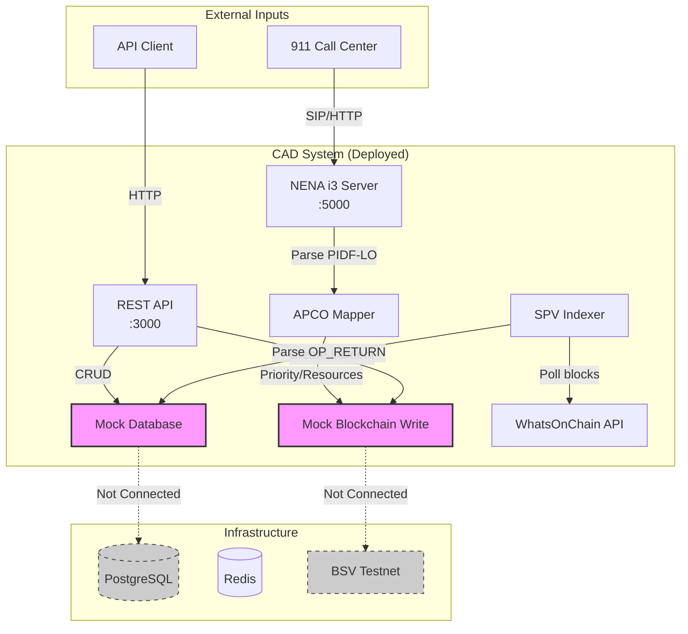
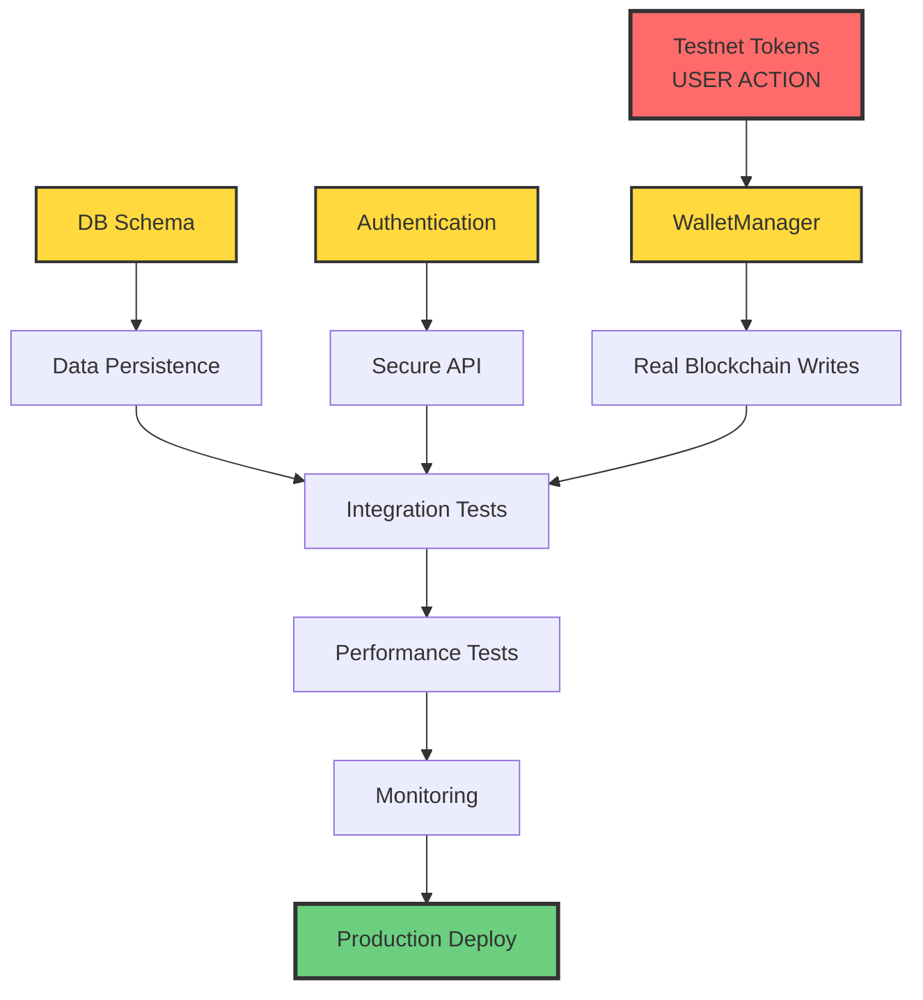

# BSV CAD System - Project Status & Roadmap

**Updated**: 2025-11-20 16:14 UTC  
**Repository**: https://github.com/frogitzamna-wq/cad (PUBLIC)  
**Status**: Phase 1 Complete, Phase 2 In Progress

---

## 🎯 Vision

Transform legacy CAD systems (Avalon/K1/CityShob) into blockchain-native emergency dispatch using BSV for:
- **Immutable audit trail** (every event on-chain)
- **1M+ TPS scalability** (Teranode)
- **Self-sovereign identity** (DIDs for officers)
- **P2P communication** (no central gateway)
- **NENA i3 compliance** (911 standard)

---

## 📊 Current State

### Implemented ✅ (Phase 1 Complete)

| Component | Status | Lines | Tested | Location |
|-----------|--------|-------|--------|----------|
| **Core Contracts** | ✅ | 990 | ⚠️ | `src/contracts/` |
| **Managers** | ✅ | 450 | ⚠️ | `src/managers/` |
| **REST API** | ✅ | 320 | ✅ | `src/api/routes/` |
| **SPV Indexer** | ✅ | 907 | ⚠️ | `src/indexer/` |
| **NENA i3 Server** | ✅ | 291 | ✅ | `src/adapters/nena-i3/` |
| **PIDF-LO Parser** | ✅ | 197 | ✅ | `src/adapters/nena-i3/pidf-lo/` |
| **APCO Mapper** | ✅ | 254 | ✅ | `src/adapters/nena-i3/apco/` |
| **Geographic Router** | ✅ | 247 | ⚠️ | `src/routing/` |
| **Load Testing** | ✅ | 123 | ⏳ | `tests/performance/` |
| **Docker Deploy** | ✅ | 500 | ✅ | `Dockerfile`, `docker-compose.yaml` |

**Total Implemented**: ~4,300 lines functional code

### In Progress 🔄 (Phase 2)

| Component | Status | Blocker | Priority |
|-----------|--------|---------|----------|
| **WalletManager** | 🔄 | Testnet tokens | P0 |
| **DB Persistence** | 🔄 | Schema design | P0 |
| **Authentication** | ❌ | Not started | P0 |
| **DID Integration** | 🔄 | Skeleton only | P1 |
| **UHRP Client** | 🔄 | Skeleton only | P1 |
| **Message Box P2P** | 🔄 | Skeleton only | P1 |
| **Monitoring** | ❌ | Not started | P2 |

### Not Started ❌

- sCrypt contract deployment scripts
- Frontend wallet UI
- CI/CD complete pipeline
- Production documentation
- Integration tests (component pairs)

---

## 🔄 System Flow (Current)



**Legend**:
- 🟩 Green = Implemented & Working
- 🟪 Purple = Mock/Placeholder
- ⬜ Gray dashed = Not connected yet

---

## 🎯 Critical Path to Production

### Path 1: Blockchain Integration (P0)

**Goal**: Real blockchain writes replacing mocks

```
WalletManager ──→ Fund Testnet Wallet ──→ Real TX Creation ──→ Broadcast to BSV
     ↓                                            ↓
  Generate HD Wallet                      Update API endpoints
     ↓                                            ↓
  Store xpriv securely                   Test end-to-end
     ↓
  Document process
```

**Dependencies**: 
- ✅ BSV SDK installed
- ⏳ Testnet tokens (USER ACTION REQUIRED)
- ❌ WalletManager.ts implementation

**Estimated**: 4-6 hours
**Blocker**: Testnet tokens

---

### Path 2: Data Persistence (P0)

**Goal**: Real PostgreSQL persistence replacing mocks

```
Design Schema ──→ Create Migrations ──→ Implement Repository ──→ Update Services
     ↓                    ↓                    ↓                      ↓
  7 tables         TypeORM/Prisma        CRUD operations        Replace mocks
     ↓                                                               ↓
  Incidents                                                   Integration tests
  Resources
  Dispatches
  Agencies
  Officers
  Events
  AuditLog
```

**Dependencies**:
- ✅ PostgreSQL running (Docker)
- ❌ Schema SQL
- ❌ ORM configuration
- ❌ Repository layer

**Estimated**: 8-12 hours
**Blocker**: None (can start now)

---

### Path 3: Authentication & Security (P0)

**Goal**: Secure API with JWT + role-based access

```
JWT Setup ──→ Auth Middleware ──→ Role Definition ──→ Protect Endpoints
     ↓              ↓                  ↓                    ↓
  Secret key    Verify tokens      ADMIN/DISPATCHER     Apply middleware
     ↓              ↓                  /OFFICER              ↓
  Generate       Refresh logic      /PUBLIC            Test auth flow
```

**Dependencies**:
- ❌ JWT library (jsonwebtoken)
- ❌ Auth middleware
- ❌ User/Role models
- ❌ Login endpoint

**Estimated**: 6-8 hours
**Blocker**: None (can start now)

---

### Path 4: Observability (P2)

**Goal**: Production-grade monitoring

```
Prometheus Metrics ──→ Grafana Dashboards ──→ Alerting Rules
        ↓                       ↓                      ↓
   prom-client          Import dashboards      Alert channels
        ↓                       ↓                      ↓
   Expose /metrics      Configure graphs       Email/Slack
```

**Dependencies**:
- ❌ prom-client library
- ❌ Prometheus server
- ❌ Grafana server
- ❌ Alert manager

**Estimated**: 4-6 hours
**Blocker**: None (can start now)

---

## 📦 Deliverables by Phase

### Phase 2A: Core Functionality (2 weeks)

**Deliverable**: System writes real transactions to blockchain

- [x] NENA i3 Server functional
- [x] APCO mapper complete
- [x] PIDF-LO parser working
- [ ] **WalletManager implemented** ⚠️ BLOCKED
- [ ] **PostgreSQL schema created**
- [ ] **Data persistence working**
- [ ] Real blockchain writes tested

**Acceptance Criteria**:
- Create incident → writes to BSV testnet
- Verify transaction on explorer
- Data persisted to PostgreSQL
- 100+ test transactions successful

---

### Phase 2B: Security & Quality (1 week)

**Deliverable**: Secured API with auth + 85% test coverage

- [ ] JWT authentication
- [ ] Role-based access control
- [ ] Unit test coverage 85%+
- [ ] Integration tests (20+ scenarios)
- [ ] Load tests documented

**Acceptance Criteria**:
- Unauthorized requests rejected (401)
- Roles enforced (403 for invalid access)
- Tests pass CI/CD
- Load test: 100 RPS sustained

---

### Phase 2C: Production Ready (1 week)

**Deliverable**: Deployable to production

- [ ] Prometheus metrics exposed
- [ ] Grafana dashboards configured
- [ ] K8s manifests complete (secrets, ingress, HPA)
- [ ] README.md comprehensive
- [ ] API documentation (OpenAPI)
- [ ] Deployment guide

**Acceptance Criteria**:
- Deploys to K8s with 1 command
- Metrics visible in Grafana
- Documentation allows new dev to onboard in <1 hour
- Health checks passing

---

## 🔀 Dependency Graph



**Color Legend**:
- 🔴 Red = External dependency (user action)
- 🟡 Yellow = Can implement now
- 🟢 Green = Final goal

---

## 🚀 Immediate Actions (Next 48 hours)

### Action 1: Create PostgreSQL Schema ⚡ HIGH PRIORITY

**Why**: Unblocks data persistence (no external dependencies)

```bash
# 1. Design schema
vim migrations/001_initial_schema.sql

# 2. Apply migration
docker exec -i cad-postgres psql -U cad_user -d cad_db < migrations/001_initial_schema.sql

# 3. Test
npm run test:db
```

**Estimated**: 3 hours  
**Output**: 7 tables created, migrations working

---

### Action 2: Implement WalletManager ⚡ HIGH PRIORITY

**Why**: Enables blockchain writes (waiting on tokens)

```bash
# 1. Implement class
vim src/blockchain/WalletManager.ts

# 2. Add tests
vim tests/unit/blockchain/WalletManager.test.ts

# 3. Integration (when tokens available)
npm run test:wallet
```

**Estimated**: 4 hours  
**Output**: WalletManager ready, waiting for tokens to test

---

### Action 3: Add JWT Authentication 🔒 MEDIUM PRIORITY

**Why**: Secures API before any external exposure

```bash
# 1. Install deps
npm install jsonwebtoken bcrypt

# 2. Implement auth
vim src/auth/JWTAuth.ts

# 3. Protect routes
vim src/api/middleware/auth.ts

# 4. Test
npm run test:auth
```

**Estimated**: 5 hours  
**Output**: API secured with JWT

---

### Action 4: Complete README.md 📚 MEDIUM PRIORITY

**Why**: Public repo needs good onboarding

```bash
# 1. Write comprehensive README
vim README.md

# Sections:
# - Quick start
# - Architecture diagram
# - API examples
# - Development setup
# - Testing
# - Deployment
```

**Estimated**: 2 hours  
**Output**: Professional README for public repo

---

## 📈 Progress Tracking

### Week 1 (Current)
- [x] NENA i3 implementation
- [x] Load testing setup
- [x] Make repo public
- [ ] PostgreSQL schema
- [ ] WalletManager (blocked)

### Week 2
- [ ] DB persistence complete
- [ ] Authentication complete
- [ ] Unit tests 85%+
- [ ] README.md complete

### Week 3
- [ ] Integration tests
- [ ] Monitoring setup
- [ ] K8s production manifests
- [ ] API documentation

### Week 4
- [ ] Performance testing
- [ ] Production deployment
- [ ] User acceptance testing

---

## 🎓 Knowledge Transfer

### For New Developers

**Read first**:
1. `README.md` - Quick start
2. `WARP.md` - Architecture vision
3. `PROJECT_STATUS.md` - Current state (this file)
4. `docs/NENA_I3_INTEGRATION.md` - 911 protocol

**Then explore**:
- `src/adapters/nena-i3/` - 911 call handling
- `src/api/routes/` - REST endpoints
- `src/indexer/` - Blockchain monitoring
- `tests/` - Examples of usage

**Development workflow**:
```bash
# 1. Clone
git clone git@github.com:frogitzamna-wq/cad.git
cd cad

# 2. Install
npm install

# 3. Start services
docker compose up -d

# 4. Run API
npm run dev

# 5. Test
npm test
npm run test:load
```

---

## 📞 Questions & Answers

**Q: Can I deploy to production now?**  
A: No. Critical blockers: WalletManager (needs tokens), Auth (needs implementation), DB schema (needs creation)

**Q: What's the fastest path to demo?**  
A: Current system works as demo with mock data. For real demo: implement PostgreSQL schema (3 hours)

**Q: How do I contribute?**  
A: Check `PROJECT_STATUS.md` Action items, pick one, create PR against `research` branch

**Q: Where are the tests?**  
A: Unit tests in `tests/unit/`, E2E in `tests/e2e/`, performance in `tests/performance/`

**Q: How do I run the i3 server?**  
A: `npm run start:i3` (port 5000), then POST to `/i3/v1/callStart`

---

**Next Review**: When testnet tokens available  
**Contact**: Check GitHub issues for coordination
