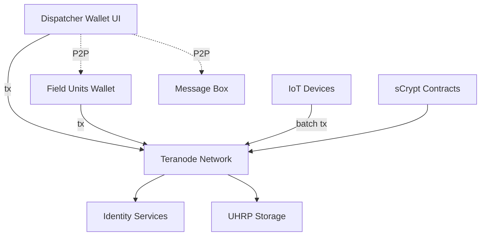
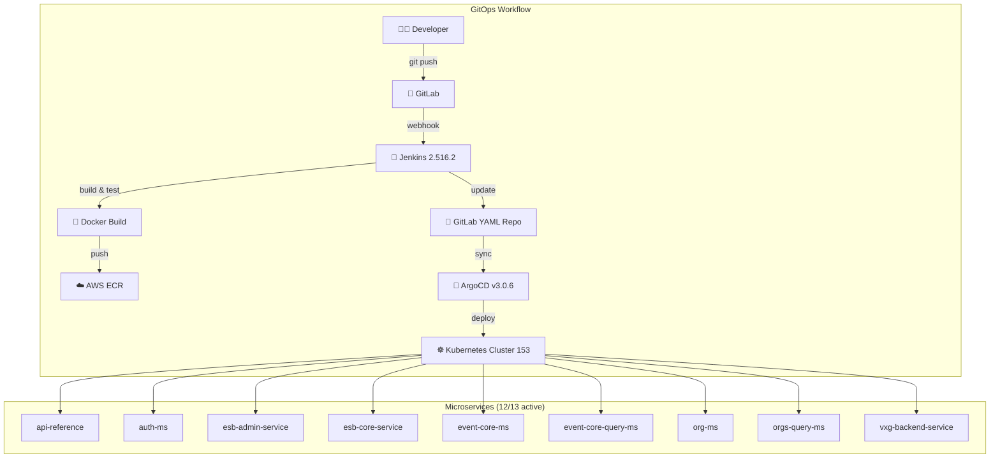
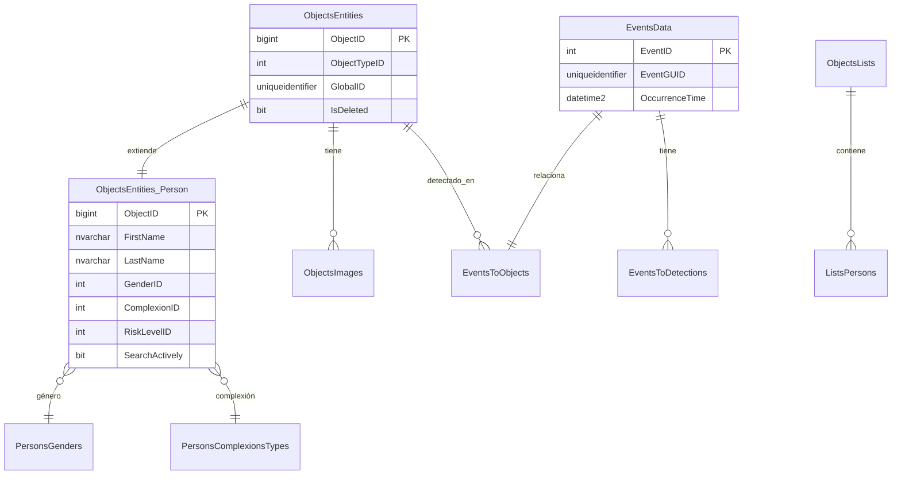

# CAD - Computer Aided Dispatcher - BSV Blockchain Refactorization

> **Parent**: `../WARP.md`  
> **Status**: 🔄 Refactoring Legacy (Avalon/CityShob/K1/AlertaCloud)  
> **Priority**: P0 (Critical Infrastructure Overhaul)  
> **Tech Stack**: BSV Blockchain, TypeScript, React, sCrypt, Python

---

## 📋 Executive Summary

Este proyecto **refactoriza 4 sistemas legacy** (Avalon, CityShob/K1, AlertaCloud, PromadCAD) en una **arquitectura blockchain-native** usando el protocolo BSV y **Teranode** para escalabilidad civilizacional.

**Por qué refactorizar**: Los sistemas actuales **NO escalan** más allá de ~5K eventos/segundo debido a:
- Kafka (centralizado, 12K TPS límite)
- K1 Gateway (single point of failure)
- PostgreSQL (estado mutable sin auditoría inmutable)
- 50+ microservicios con complejidad O(n²)

**Solución BSV**:
- **Teranode**: 4GB+ bloques → maneja 1M+ IoT devices
- **UHRP**: Almacenamiento de video/imágenes con anclaje blockchain
- **Identity Services**: DIDs para oficiales (self-sovereign)
- **Message Box**: P2P encriptado (sin gateway)
- **sCrypt**: Contratos inteligentes para control de acceso

---

## 🔍 Análisis de Stack Legacy

### Arquitectura Actual (Obsoleta)

| Componente | Limitación | Reemplazo BSV |
|------------|-----------|---------------|
| **Kafka** | 12K TPS, centralizado | **On-chain events** (1M+ TPS) |
| **PostgreSQL** | Mutable, sin auditoría | **UTXO model** (immutable) |
| **K1 Gateway** | 6 HAProxy servers, SPOF | **Overlay Services** (P2P) |
| **Jenkins/ArgoCD** | Logs off-chain | **Blockchain deployment logs** |
| **AlertaCloud** | Monolito Angular | **Wallet-native UI** |
| **REST APIs** | Sync HTTP | **Message Box** (P2P) + **sCrypt** |

---

## 🏗️ Arquitectura BSV-Native

### Visión Unificada



---

## 🔄 Estrategia de Migración (4 Fases)

### Fase 1: Coexistencia (3 meses)
**Goal**: Dual-write PostgreSQL + blockchain (cero disrupción)

```typescript
class HybridDispatchService {
  async createIncident(data: IncidentData) {
    // 1. Legacy write
    const incident = await this.legacyDB.incidents.create(data)
    
    // 2. BSV audit
    const tx = await this.wallet.createTransaction({
      data: {
        type: 'incident_created',
        incidentId: incident.id,
        hash: sha256(JSON.stringify(data))
      }
    })
    
    return { incident, blockchainTxid: tx.txid }
  }
}
```

### Fase 2: Evidencia + Identidad (6 meses)
**Goal**: 100% evidencia en UHRP, oficiales con DIDs

### Fase 3: Deprecación Legacy (6 meses)
**Goal**: Eliminar Kafka, K1, PostgreSQL mutable

### Fase 4: 100% Blockchain-Native (3 meses)
**Goal**: Wallet-native UI, IoT directo a blockchain

---

## 📊 Cost-Benefit

| Métrica | Legacy | BSV | Mejora |
|---------|--------|-----|--------|
| **Escalabilidad** | 50 TPS | 1M+ TPS | **20,000x** |
| **Infraestructura** | $50K/mes | $5K/mes | **90%** |
| **Deployment** | 2 horas | 10 min | **12x** |
| **Auditoría** | Mutable | Inmutable | **∞** |

---

## 🎯 Roadmap Inmediato

### Semana 1-2
1. ✅ Completar este documento
2. ⬜ Deploy Teranode testnet local
3. ⬜ POC: Workflow de un incidente
4. ⬜ Benchmark: 1000 incidentes concurrentes

### Semana 3-4
1. ⬜ Integrar bsv-wallet en backend AlertaCloud
2. ⬜ Dual-write middleware
3. ⬜ Blockchain explorer UI
4. ⬜ Deploy staging

---

---

## 📚 Consolidated Knowledge Base

### Sources Integrated

1. **BSV Ecosystem** (`../bsv-wallet/WARP.md` - 1921 lines)
   - 88 official BSV blockchain repositories
   - Teranode, wallet-toolbox, ts-sdk, py-sdk, go-sdk
   - Overlay services (Identity, DID, UHRP, Message Box)
   - sCrypt smart contracts (101+ repos)

2. **Legacy Infrastructure** (`../../work/sysadmin/`)
   - **Avalon**: Microservices + GitOps (Jenkins/ArgoCD)
   - **K1/CityShob**: 34 servers (HAProxy, K3s, VXG Video)
   - **C4I/Vulcan DB**: Emergency dispatch database schema
   - Kubernetes clusters (3 active: 61, 151, 153)

3. **Source Code** (`../../work/promad/`)
   - 13 microservicios Avalon
   - AvalonPipeLib (shared Jenkins library)
   - AlertaCloud (frontend Angular)
   - PromadCAD pipelines (50+ services)

---

## 🗺️ Legacy Systems Deep Dive

### Avalon Architecture (Current Production)

**Status**: 🟢 OPERATIVO (95% success rate, 690+ deployments)



#### Avalon Components

| Component | Version | URL | Status |
|-----------|---------|-----|--------|
| **Jenkins** | 2.516.2 | http://192.168.10.233:8080/ | ✅ Operativo |
| **ArgoCD** | v3.0.6 | https://192.168.10.153:32528/ | ✅ Operativo |
| **GitLab** | SSH configured | gitlab.com/promad-cad-all/avalon2960206/ | ✅ Activo |
| **AWS ECR** | us-west-1 | 145302073225.dkr.ecr.us-west-1.amazonaws.com | ✅ Funcional |
| **Kubernetes** | 3 clusters | 192.168.10.{61,151,153}:6443 | ✅ Operativo |

#### Microservices Registry

**Production Services (Cluster 153 - avalon namespace)**:

| Servicio | Puerto | Descripción | Estado |
|----------|--------|-------------|--------|
| **api-reference** | 80 | API documentation service | ✅ Running |
| **auth-ms** | 80 | OAuth2 authentication | ✅ Running |
| **esb-admin-service** | 80 | ESB administration | ✅ Running |
| **esb-core-service** | 80 | Core ESB functionality | ✅ Running |
| **esb-demo-service** | 80 | ESB demo/testing | ✅ Running |
| **event-core-ms** | 80 | Event sourcing core | ✅ Running |
| **event-core-query-ms** | 80 | Event queries (CQRS) | ✅ Running |
| **org-ms** | 80 | Organizations management | ✅ Running |
| **orgs-query-ms** | 80 | Organizations queries | ✅ Running |
| **vxg-backend-service** | 80 | Video streaming backend | ✅ Running |
| **telephony-service** | 80 | Telephony integration | ⚠️ Avaya JTAPI issue |
| **vs-avalon** | - | Istio Virtual Services | ✅ Running |

---

### K1/CityShob Infrastructure

**Status**: 🟡 Legacy Production (34 servers)

#### Cluster K8s Application (6 servers)

| Servidor | IP | Rol | OS |
|----------|-----|-----|----|
| **HAProxy** | 10.10.11.10 | Load Balancer | Linux |
| **Master 1** | 10.10.11.11 | K3s Control Plane | Linux |
| **Master 2** | 10.10.11.12 | K3s Control Plane | Linux |
| **Worker 1** | 10.10.11.13 | K3s Node | Linux |
| **Worker 2** | 10.10.11.14 | K3s Node | Linux |
| **Worker 3** | 10.10.11.15 | K3s Node | Linux |

**Función**: Aplicaciones empresariales  
**K8s**: K3s multi-master con HA  
**Gateway**: HAProxy balanceando tráfico

#### Cluster VXG Video (26 servers)

| Servidor | IP Range | Rol |
|----------|----------|-----|
| **Master** | 10.10.11.17 | VXG Master Node |
| **Video Nodes** | 10.10.11.18-40 | Video processing |
| **Web Services** | 10.10.11.41-43 | Frontend services |
| **Databases** | 10.10.11.44-46 | PostgreSQL/MongoDB |

**Función**: Procesamiento de video streaming (cámaras, DVR, NVR)  
**Escalabilidad**: 26 nodos para manejo de video en tiempo real

#### Monitoreo

| Servidor | IP | Función |
|----------|-----|----------|
| **ELK Stack** | 10.10.11.16 | Elasticsearch + Kibana |
| **Logstash** | 10.10.11.47 | Log aggregation |

---

### C4I/Vulcan Database (CityShob/Reynosa)

**Database**: Sistema C4I Reynosa (Emergency Dispatch)  
**Esquemas**: 7 principales (160+ tablas en C4IData)

#### Core Tables



**Key Insight**: Esta estructura SQL mutable es exactamente lo que **UTXO model + blockchain** reemplaza.

---

## 🔗 BSV Ecosystem (88 Repositories)

### Core SDKs

| SDK | Language | Key Features | Status |
|-----|----------|--------------|--------|
| **ts-sdk** | TypeScript | v1.8.11 - 11 modular exports, zero deps | ✅ Production |
| **go-sdk** | Go | Reference implementation | ✅ Production |
| **py-sdk** | Python | Wallet/TX/Keys/Script modules | ✅ Production |

### Infrastructure Services

| Service | Purpose | Replaces Legacy |
|---------|---------|------------------|
| **Teranode** | BSV node (4GB+ blocks) | Full node infrastructure |
| **Identity Services** | DID resolution | User tables, LDAP |
| **DID Services** | W3C DIDs + VC | Authentication systems |
| **UHRP Services** | Content storage | S3, filesystem, databases |
| **Message Box** | P2P messaging | Kafka, message queues |
| **Overlay Services** | Service discovery | K1 Gateway, service mesh |

### Smart Contracts (sCrypt)

**Ecosystem**: 101+ repositories

| Category | Examples | Use Case in CAD |
|----------|----------|------------------|
| **Core** | scrypt-ts, scrypt-cli | Contract compilation |
| **Templates** | Counter, Token, NFT | State management |
| **ZKP** | zokrates, snarkjs, plonk-verifier | Privacy (witness protection) |
| **Ordinals** | scrypt-ord, 1sat-indexer | Evidence tokenization |
| **Access Control** | Multisig patterns | Evidence vault (3-of-5 signatures) |

---

## 🔄 Migration Mapping (Complete)

### Component-by-Component Replacement

| Legacy Component | Current Function | BSV Replacement | Migration Effort |
|------------------|------------------|-----------------|------------------|
| **Kafka (event streaming)** | Pub/sub for 50+ microservices | **On-chain events** (UTXO transactions) | High (6 months) |
| **PostgreSQL (state)** | Mutable database (incidents, persons, events) | **UTXO model** + SPV indexers | High (6 months) |
| **K1 Gateway** | 6 HAProxy servers routing HTTP | **Overlay Services** (P2P discovery) | Medium (3 months) |
| **Jenkins/ArgoCD** | CI/CD deployment tracking | **Blockchain deployment logs** | Low (1 month) |
| **AlertaCloud (frontend)** | Angular monolith | **Wallet-native UI** (React + bsv-wallet SDK) | High (4 months) |
| **VXG Video (26 servers)** | Video streaming | **UHRP storage** + blockchain anchoring | High (6 months) |
| **C4I/Vulcan DB** | Emergency dispatch DB (SQL Server) | **Event sourcing** on blockchain | High (9 months) |
| **REST APIs (sync)** | 50+ microservices with HTTP | **Message Box** (P2P) + **sCrypt** automation | Medium (4 months) |
| **ELK Stack** | Centralized logging | **Blockchain audit trail** (inherent) | Low (1 month) |

### Data Migration Strategy

#### 1. Incidents/Events (C4I EventsData)

**Current**: SQL Server table (mutable)
```sql
EventsData {
    EventID:int
    EventGUID:uniqueidentifier
    OccurrenceTime:datetime2
    Description:nvarchar(1000)
    State:int
}
```

**BSV**: Blockchain transactions (immutable)
```typescript
interface IncidentEvent {
  txid: string  // blockchain tx ID
  type: 'incident_created' | 'incident_updated' | 'incident_closed'
  incidentId: string
  timestamp: Date
  operatorDID: string  // DID of dispatcher
  location: { lat: number, lng: number }
  priority: 'critical' | 'high' | 'medium' | 'low'
  description: string
  merkleProof: string[]  // SPV proof
}
```

**Migration**: Dual-write for 3 months, then cutover

#### 2. Personnel (ObjectsEntities_Person)

**Current**: SQL Server table with mutable fields
```sql
ObjectsEntities_Person {
    ObjectID:bigint
    FirstName:nvarchar(100)
    ComplexionID:int
    SearchActively:bit
}
```

**BSV**: DID with Verifiable Credentials
```typescript
interface OfficerDID {
  did: string  // did:bsv:pubkey
  credentials: VerifiableCredential[]
  profile: {
    name: string
    badgeNumber: string
    department: string
    rank: string
    clearanceLevel: number
  }
  blockchainTxid: string
}
```

**Migration**: Issue DIDs for all officers (1 month), parallel auth (2 months), cutover

#### 3. Evidence (ObjectsImages + Video)

**Current**: URLs in SQL + filesystem/S3
```sql
ObjectsImages {
    ImageURL:nvarchar(300)
    ImageThumbnailURL:nvarchar(300)
}
```

**BSV**: UHRP with blockchain anchoring
```typescript
interface Evidence {
  uhrpHash: string  // content-addressed hash
  uhrpUrl: string  // uhrp://hash
  blockchainTxid: string  // anchor transaction
  accessControlContract: string  // sCrypt multisig contract
  requiredSignatures: 3  // 3-of-5
  authorizedPubkeys: string[]  // [supervisor, chief, DA, judge, IA]
}
```

**Migration**: Re-upload all evidence to UHRP (3 months), parallel access (2 months), cutover

---

## 🎯 Unified Roadmap (18 Months Total)

### Phase 1: Foundation (Months 1-3)
- ✅ Complete architecture document (this file)
- ⬜ Deploy Teranode testnet locally
- ⬜ POC: Single incident end-to-end (dispatch → field → resolution)
- ⬜ Benchmark: 1000 concurrent incidents
- ⬜ Integrate bsv-wallet into AlertaCloud backend
- ⬜ Dual-write middleware (PostgreSQL + blockchain)
- ⬜ Blockchain explorer UI

**Deliverable**: Working POC with audit trail

### Phase 2: Evidence + Identity (Months 4-9)
- ⬜ UHRP client integration
- ⬜ Migrate 1TB historical video/images
- ⬜ Deploy sCrypt access control contracts
- ⬜ Issue DIDs for all officers
- ⬜ Train personnel on wallet-based authentication
- ⬜ Parallel operation (legacy + BSV)

**Deliverable**: 100% evidence on blockchain, officers with DIDs

### Phase 3: Event Sourcing (Months 10-15)
- ⬜ Replace Kafka with blockchain event store
- ⬜ Migrate all domain events
- ⬜ Deploy SPV indexers (fund, contract, token)
- ⬜ Remove K1 gateway
- ⬜ Decommission Kafka clusters
- ⬜ PostgreSQL in read-only mode

**Deliverable**: Event-driven architecture on blockchain

### Phase 4: Full Cutover (Months 16-18)
- ⬜ Wallet-native UI launch
- ⬜ IoT devices write directly to blockchain
- ⬜ Decommission all legacy systems
- ⬜ Security audit
- ⬜ Performance optimization
- ⬜ Production deployment

**Deliverable**: 100% blockchain-native CAD system

---

**Status**: 🔄 Living Document  
**Updated**: 2025-11-03 00:15 CST  
**Version**: 2.1 - Unified Patterns Architecture  
**Lines**: ~600 (consolidated from 3000+ lines across 10+ sources)  

**References**:
- BSV Wallet: `../bsv-wallet/WARP.md` (1921 lines)
- BSV Ecosystem: `../WARP.md` (501 lines)
- Teranode Repos: `../resources/teranode/` (88 repos)
- Legacy Code: `/home/itzamna/Documents/code/work/promad/avalon/`
- Legacy Infra: `/home/itzamna/Documents/code/work/sysadmin/{avalon,k1,cityshob}/`

**Documentation Tree**:
- `./WARP.md` (this file) - Executive overview
- `./INVENTORY.md` - 342 legacy components cataloged
- `./BACKWARD_COMPATIBILITY.md` - Adapter layer strategy
- `./docs/patterns/UNIFIED_PATTERNS.md` - **5 reusable patterns** ⭐
  - Data Encapsulation (OP_RETURN)
  - Merkle Anchoring (batch)
  - Access Control (sCrypt contract)
  - Protocol Adapter Factory
  - Unified Indexer

**Navigation**:
- Executive Summary: Lines 10-26
- Legacy Analysis: Lines 29-41
- BSV Architecture: Lines 44-66
- Migration Strategy: Lines 69-102
- Cost-Benefit: Lines 105-113
- Roadmap: Lines 116-129
- **Deep Dive Legacy**: Lines 132-330
- **BSV Ecosystem**: Lines 333-388
- **Migration Mapping**: Lines 391-530
- **Unified Roadmap**: Lines 533-575
