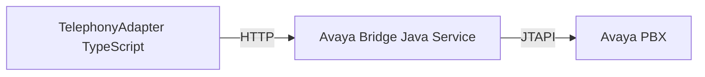

# Vendor Integration Complexity Analysis

**Generated**: 2025-11-03 06:17 CST  
**Purpose**: Deep-dive complexity analysis for legacy vendor integrations

---

## 🎯 Complexity Ranking

| Adapter | Vendor Integration | Complexity | Effort (Weeks) | Risk |
|---------|-------------------|------------|----------------|------|
| **Telephony** | **Avaya JTAPI** | 🔴 **Very High** | 8-12 | ⚠️ Critical |
| **Video** | **VXG Video (26 servers)** | 🔴 **Very High** | 10-14 | ⚠️ Critical |
| **Telephony** | **Oreka Call Recorder** | 🟠 **High** | 4-6 | Medium |
| **Video** | **C-Insight Analytics** | 🟠 **High** | 4-6 | Medium |
| **Video** | **Dahua Cameras** | 🟡 **Medium** | 3-4 | Low |
| **Messaging** | **Redis WebSocket** | 🟢 **Low** | 1-2 | Low |

---

## 🔴 Critical Path: Avaya JTAPI Integration

### Challenge

**Avaya JTAPI (Java Telephony API)** es una librería **propietaria Java** para control de PBX Avaya. **No existe cliente Node.js/TypeScript nativo**.

### Current Usage

```yaml
Legacy Services:
  - telefonía (main service)
  - telefonia-durango (regional)
  - telefonia-jalis (regional)
  
Dependencies:
  - Avaya Communication Manager (PBX)
  - JTAPI JAR files (proprietary)
  - Java Runtime Environment
```

### Options for Integration

#### Option 1: Java FFI (Foreign Function Interface)

**Pros**:
- Direct JTAPI usage
- No middleware needed

**Cons**:
- Complex: Node.js ↔ Java IPC
- Memory management issues
- Hard to debug

**Libraries**:
- `node-java` (deprecated, unstable)
- `java-bridge` (experimental)

**Verdict**: ❌ Not recommended (too fragile)

---

#### Option 2: REST Wrapper (Java Microservice)

**Pros**:
- Clean separation (Node.js adapter ← HTTP → Java bridge)
- Stable communication
- Easier testing

**Cons**:
- Extra latency (~50-100ms)
- Additional deployment (Java service)

**Architecture**:



**Implementation**:

```java
// File: avaya-bridge/src/main/java/com/cad/avaya/AvayaBridgeService.java
@RestController
@RequestMapping("/api/calls")
public class AvayaBridgeService {
    private final JtapiConnection jtapi;
    
    @PostMapping("/initiate")
    public CallResponse initiateCall(@RequestBody CallRequest request) {
        try {
            // 1. Connect to Avaya PBX
            Provider provider = jtapi.getProvider();
            
            // 2. Get calling terminal
            Terminal callingTerminal = provider.getTerminal(request.from());
            
            // 3. Place call
            Call call = provider.createCall();
            Connection[] connections = call.connect(
                callingTerminal, 
                new Address(request.to())
            );
            
            return new CallResponse(
                call.getCallID(),
                connections[0].getState().toString()
            );
        } catch (Exception e) {
            throw new AvayaException("Failed to place call", e);
        }
    }
    
    @PostMapping("/{callId}/end")
    public void endCall(@PathVariable String callId) {
        Call call = jtapi.getCall(callId);
        call.drop();
    }
    
    @GetMapping("/{callId}")
    public CallStatus getCallStatus(@PathVariable String callId) {
        Call call = jtapi.getCall(callId);
        return new CallStatus(
            callId,
            call.getState(),
            call.getDuration()
        );
    }
}
```

**Node.js Client**:

```typescript
// File: packages/telephony/src/bridges/avaya-bridge-client.ts
export class AvayaJTAPIBridge {
  private baseUrl: string;
  
  constructor(config: { host: string; port: number }) {
    this.baseUrl = `http://${config.host}:${config.port}`;
  }
  
  async makeCall(from: DID, toPhone: string): Promise<AvayaCall> {
    const response = await fetch(`${this.baseUrl}/api/calls/initiate`, {
      method: 'POST',
      headers: { 'Content-Type': 'application/json' },
      body: JSON.stringify({ from, to: toPhone })
    });
    
    if (!response.ok) {
      throw new AdapterError(
        `Avaya bridge failed: ${response.status}`,
        AdapterErrorCode.AVAYA_CONNECTION_FAILED
      );
    }
    
    return await response.json();
  }
  
  async endCall(callId: string): Promise<void> {
    await fetch(`${this.baseUrl}/api/calls/${callId}/end`, {
      method: 'POST'
    });
  }
  
  async getCallStatus(callId: string): Promise<CallStatus> {
    const response = await fetch(`${this.baseUrl}/api/calls/${callId}`);
    return await response.json();
  }
}
```

**Verdict**: ✅ **Recommended** (clean, testable, stable)

**Effort**: 8-12 weeks (6 weeks Java bridge + 2 weeks Node.js client + 4 weeks testing)

---

#### Option 3: Replace Avaya with SIP/TLS (Future)

**Pros**:
- Open standard (RFC 3261)
- No proprietary libraries
- Modern protocol

**Cons**:
- Requires Avaya SIP gateway configuration
- Not immediate (depends on Avaya admin)

**Libraries**:
- `sip.js` (TypeScript SIP client)
- `JsSIP` (JavaScript SIP library)

**Verdict**: ✅ **Long-term goal** (Phase 3-4 of migration)

---

## 🔴 Critical Path: VXG Video Integration

### Challenge

**VXG Video Cloud** tiene 26 servidores dedicados (10.10.11.17-43) con arquitectura propietaria. Migrar a UHRP sin downtime es crítico.

### Current Architecture

```yaml
VXG Cluster:
  Master: 10.10.11.17
  Video Nodes: 10.10.11.18-40 (23 servers)
  Web Services: 10.10.11.41-43 (3 servers)
  
Functionality:
  - RTSP/RTMP ingestion
  - HLS/DASH transcoding
  - Cloud recording
  - PTZ camera control
  
Bandwidth: ~10 Gbps aggregate
Storage: ~500 TB (historical recordings)
```

### Migration Strategy

#### Phase 1: Dual-Write (Months 1-3)

**All new recordings → UHRP + VXG**

```typescript
class VideoAdapter {
  async recordIncident(incidentId: string, streams: CameraStream[]) {
    // 1. Record to VXG (legacy)
    const vxgRecording = await this.vxgProxy.record(streams);
    
    // 2. Upload to UHRP (new)
    const uhrpHash = await this.uhrpClient.upload(vxgRecording.data);
    
    // 3. Anchor to blockchain
    const txid = await this.blockchainLogger.logEvent({
      type: 'evidence_recorded',
      incidentId,
      uhrpHash,
      vxgId: vxgRecording.id, // Keep legacy reference
      timestamp: new Date()
    });
    
    return { uhrpHash, vxgId: vxgRecording.id, txid };
  }
}
```

#### Phase 2: Historical Migration (Months 4-9)

**Background job: VXG → UHRP**

```typescript
class VXGMigrationWorker {
  async migrateHistoricalRecordings() {
    // 1. List all VXG recordings (paginated)
    const recordings = await this.vxgClient.listRecordings({
      startDate: '2020-01-01',
      endDate: '2025-01-01',
      limit: 1000
    });
    
    for (const recording of recordings) {
      try {
        // 2. Download from VXG
        const videoData = await this.vxgClient.download(recording.id);
        
        // 3. Upload to UHRP
        const uhrpHash = await this.uhrpClient.upload(videoData);
        
        // 4. Anchor to blockchain
        await this.blockchainLogger.logEvent({
          type: 'evidence_recorded',
          incidentId: recording.incidentId,
          uhrpHash,
          vxgId: recording.id,
          timestamp: recording.timestamp,
          migrated: true
        });
        
        console.log(`Migrated: ${recording.id} → ${uhrpHash}`);
      } catch (error) {
        console.error(`Failed to migrate ${recording.id}`, error);
        // Retry queue
      }
    }
  }
}
```

**Estimated Duration**: 6 months @ 100 GB/day = ~500 TB total

#### Phase 3: Read Migration (Months 10-12)

**Serve videos from UHRP, VXG read-only**

```typescript
class VideoAdapter {
  async getRecording(incidentId: string): Promise<VideoStream> {
    // 1. Query blockchain for UHRP hash
    const event = await this.queryEvidenceEvent(incidentId);
    
    if (event.uhrpHash) {
      // Modern: Stream from UHRP
      return this.uhrpClient.stream(event.uhrpHash);
    } else if (event.vxgId) {
      // Fallback: Stream from VXG (not migrated yet)
      return this.vxgProxy.stream(event.vxgId);
    } else {
      throw new Error('Recording not found');
    }
  }
}
```

#### Phase 4: VXG Deprecation (Month 18)

**Decommission 26 servers**

```yaml
Action Items:
  1. Verify 100% recordings in UHRP
  2. Stop VXG write operations
  3. Archive VXG data (cold storage backup)
  4. Decommission servers 10.10.11.17-43
  5. Reallocate hardware ($8K/month savings)
```

---

## 🟠 Medium Complexity: Oreka Call Recorder

### Challenge

**Oreka** (Open Source Call Recording) integra con Avaya para grabar llamadas. Needs to log recordings to blockchain.

### Current Integration

```yaml
Service: ms-grabacion-oreka
Function: Record Avaya calls, store in filesystem
Storage: /mnt/recordings/ (NFS mount)
Format: WAV (PCM 16-bit)
```

### Adapter Strategy

```typescript
class OrekaRecorderBridge {
  async onCallRecorded(event: OrekaCallEvent) {
    // 1. Get recording file path
    const recordingPath = event.filePath; // /mnt/recordings/2025/11/03/call-12345.wav
    
    // 2. Upload to UHRP
    const audioData = await fs.readFile(recordingPath);
    const uhrpHash = await this.uhrpClient.upload(audioData, {
      contentType: 'audio/wav'
    });
    
    // 3. Anchor to blockchain
    await this.blockchainLogger.logEvent({
      type: 'call_recorded',
      callId: event.callId,
      callerDID: event.callerDID,
      calleeDID: event.calleeDID,
      duration: event.duration,
      recordingUHRP: uhrpHash,
      timestamp: new Date()
    });
    
    // 4. Delete local file (optional - keep for 30 days)
    setTimeout(() => {
      fs.unlink(recordingPath);
    }, 30 * 24 * 60 * 60 * 1000);
  }
}
```

**Effort**: 4-6 weeks (integration + testing)

---

## 🟡 Low Complexity: Redis WebSocket

### Challenge

**Redis-backed WebSocket** para real-time messaging. Easy to replace with Message Box.

### Current Architecture

```yaml
Services:
  - websocket (WebSocket server)
  - ms-adapter-websocket (adapter)
  - ms_websocket_redis (Redis pub/sub)
  
Flow:
  Client → WebSocket → Redis Pub/Sub → Other Clients
```

### Adapter Strategy

```typescript
class MessagingAdapter {
  async sendMessage(from: DID, to: DID, content: string) {
    const toCapabilities = await this.queryDIDCapabilities(to);
    
    if (toCapabilities.messageBox) {
      // Modern: P2P via Message Box
      await this.messageBoxClient.send(from, to, content);
    } else {
      // Legacy: broadcast via Redis
      await this.redisWsBridge.publish({
        from, to, content,
        channel: `user:${to}`
      });
    }
    
    // Log to blockchain (hash only)
    await this.blockchainLogger.logEvent({
      type: 'message_sent',
      from, to,
      contentHash: sha256(content),
      protocol: toCapabilities.messageBox ? 'message-box' : 'redis-ws',
      timestamp: new Date()
    });
  }
}
```

**Effort**: 1-2 weeks (minimal complexity)

---

## 📊 Summary: Effort Estimation

| Integration | Weeks | Dependencies | Blocking? |
|-------------|-------|--------------|-----------|
| **Avaya JTAPI Bridge (Java)** | 8-12 | Java 11+, JTAPI JARs | ✅ Critical (telephony) |
| **VXG → UHRP Migration** | 26 | UHRP service, 500TB bandwidth | ✅ Critical (video) |
| **Oreka → UHRP** | 4-6 | UHRP service | ⚠️ Medium (call recording) |
| **C-Insight Analytics** | 4-6 | C-Insight API docs | ⚠️ Medium (LPR) |
| **Dahua Cameras** | 3-4 | Dahua SDK | 🟢 Low (cameras) |
| **Redis WebSocket** | 1-2 | Message Box deployed | 🟢 Low (messaging) |
| **TOTAL** | **46-64 weeks** | - | - |

**Parallelization**: Can run 3 teams concurrently → **16-22 weeks wall time**

---

## 🎯 Recommended Approach

### Team Structure

```yaml
Team 1 (Telephony):
  - Java Developer (Avaya JTAPI bridge)
  - Node.js Developer (TelephonyAdapter)
  - QA Engineer
  Duration: 12 weeks
  
Team 2 (Video):
  - Backend Developer (VXG proxy)
  - DevOps Engineer (migration scripts)
  - Storage Engineer (UHRP integration)
  Duration: 14 weeks
  
Team 3 (Messaging):
  - Node.js Developer (MessagingAdapter)
  - Frontend Developer (client SDKs)
  Duration: 6 weeks
```

### Milestones

```yaml
Month 1:
  - Avaya Java bridge POC
  - VXG dual-write enabled
  - Redis WebSocket bridge complete
  
Month 2:
  - Avaya bridge production-ready
  - VXG historical migration started (100 GB/day)
  
Month 3:
  - Telephony adapter live (50% calls via WebRTC)
  - Video adapter dual-mode
  
Month 6:
  - VXG historical migration 50% complete
  - Oreka → UHRP integration complete
  
Month 12:
  - VXG historical migration 100% complete
  - Begin VXG read-only mode
  
Month 18:
  - Decommission Avaya (emergency-only)
  - Decommission VXG (26 servers)
  - 100% blockchain-native
```

---

## 🔒 Security Considerations

### Avaya JTAPI Bridge

**Risk**: Java service exposes PBX control.

**Mitigation**:
- mTLS authentication (Node.js ↔ Java)
- IP whitelist (only adapter nodes)
- Rate limiting (100 calls/minute)
- Blockchain audit log (all JTAPI calls)

### VXG Video Access

**Risk**: 500TB historical recordings need access control.

**Mitigation**:
- sCrypt multisig contracts (3-of-5: supervisor, chief, DA, judge, IA)
- UHRP evidence URLs expire after 24 hours
- Blockchain access log (who viewed what, when)

---

**Next Steps**:
1. Approve vendor integration strategy
2. Hire Team 1 (Telephony - Java + Node.js)
3. Deploy Avaya JTAPI bridge (MVP in 4 weeks)
4. Parallel: Start VXG dual-write testing
