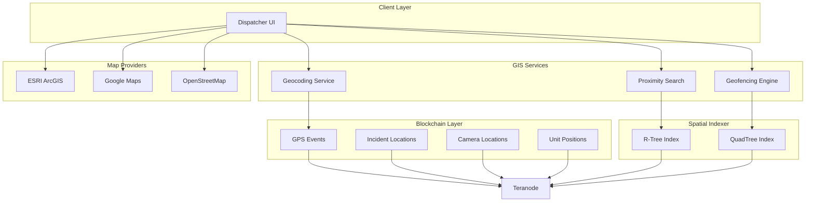
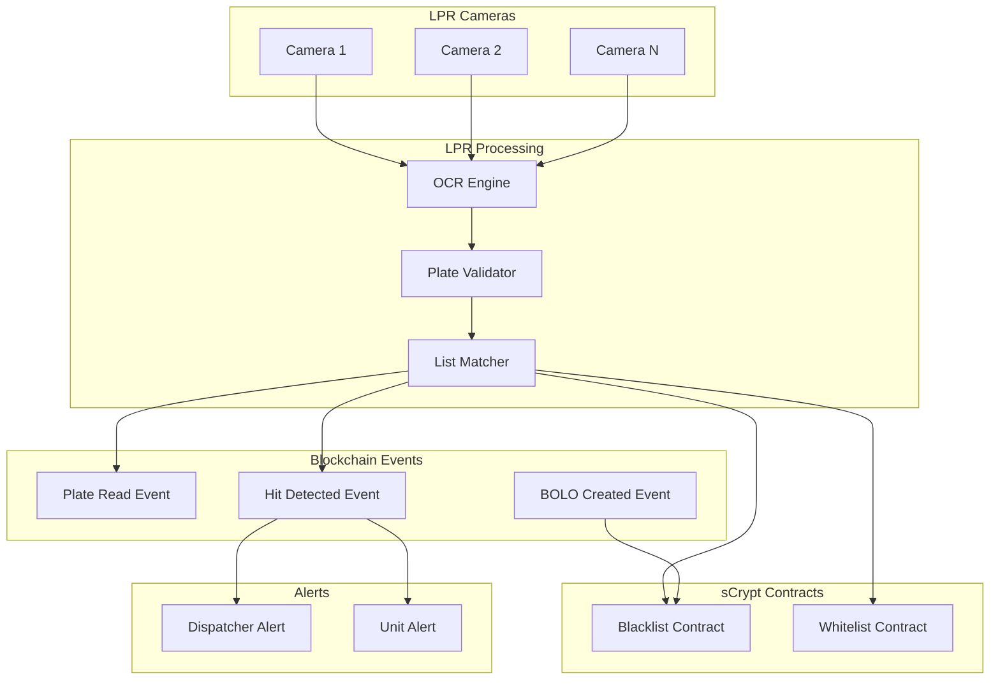
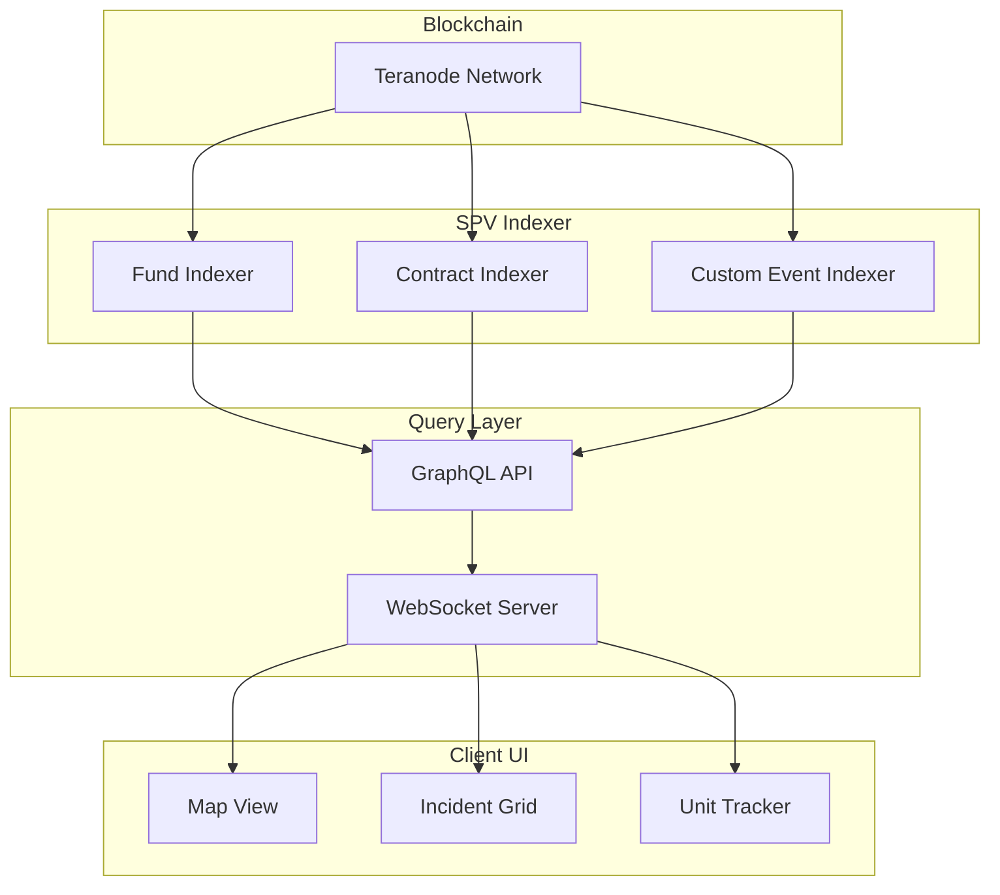

# CAD Advanced Systems - GIS, LPR, IoT, Real-Time

**Status**: 🔄 Design Phase  
**Generated**: 2025-11-03 06:40 CST  
**Complements**: `DESIGN.md` (Incident Management)

---

## 📍 1. GIS/Mapping Integration

### Current Stack (Legacy)

| Service | Technology | Function |
|---------|-----------|----------|
| **ms-core-esri** | ESRI ArcGIS | GIS core functionality |
| **ms-front-esri** | ESRI ArcGIS | Frontend map rendering |
| **ms-googlemaps** | Google Maps API | Fallback mapping |
| **gps-cad** | Custom | GPS tracking service |

### BSV Architecture



### Spatial Data in Blockchain

```typescript
// GPS event with spatial metadata
type GPSEvent = {
  type: 'gps_update';
  unitId: string;
  location: {
    lat: number;      // -90 to 90
    lng: number;      // -180 to 180
    altitude?: number; // meters
    accuracy: number;  // meters (GPS precision)
    heading: number;   // 0-360 degrees
    speed: number;     // km/h
  };
  timestamp: Date;
  geohash: string;    // Geohash for spatial indexing
};

// Incident with location
type IncidentCreatedEvent = {
  type: 'incident_created';
  incidentId: string;
  location: {
    lat: number;
    lng: number;
    address: string;
    zipCode: string;
    jurisdiction: string; // City/County
  };
  geohash: string;
  // ... other fields
};

// Camera registration (static)
type CameraRegisteredEvent = {
  type: 'camera_registered';
  cameraId: string;
  location: {
    lat: number;
    lng: number;
    address: string;
    viewDirection: number; // 0-360 degrees
    viewRadius: number;    // meters
  };
  geohash: string;
};
```

### Geohash for Spatial Indexing

**What is Geohash?**
- Encodes lat/lng into short string (e.g., "9q8yy")
- Hierarchical: longer prefix = more precise area
- Enables fast proximity queries

**Example**:
```typescript
import geohash from 'ngeohash';

// Encode location
const hash = geohash.encode(19.4326, -99.1332, 9); // "9g3gvqx0y"

// Decode location
const coords = geohash.decode('9g3gvqx0y'); // { lat: 19.4326, lng: -99.1332 }

// Get neighbors (8 surrounding cells)
const neighbors = geohash.neighbors('9g3gvqx'); 
// ['9g3gvqw', '9g3gvqy', '9g3gvqz', ...]

// Query nearby incidents
const nearbyIncidents = await indexer.query({
  geohashPrefix: '9g3gvq', // All incidents starting with this prefix
  eventType: 'incident_created',
  status: 'ACTIVE'
});
```

**Blockchain Storage**:
```typescript
// OP_RETURN data includes geohash
const opReturn = Buffer.concat([
  Buffer.from('CADEVENT'),
  Buffer.from([0x01]), // Version
  Buffer.from([0x20]), // Event type: incident_created
  timestampBuffer,
  contentHashBuffer,
  Buffer.from(geohash, 'utf8') // 9-12 bytes
]);
```

### Proximity Queries

```typescript
class ProximitySearch {
  /**
   * Find all units within radius of location
   */
  async findNearbyUnits(
    location: { lat: number; lng: number },
    radiusMeters: number,
    status?: UnitStatus[]
  ): Promise<Unit[]> {
    // 1. Calculate geohash precision for radius
    const precision = this.geohashPrecisionForRadius(radiusMeters);
    
    // 2. Get center geohash
    const centerHash = geohash.encode(location.lat, location.lng, precision);
    
    // 3. Get all neighboring cells
    const searchHashes = [centerHash, ...geohash.neighbors(centerHash)];
    
    // 4. Query blockchain for units in these cells
    const units = await Promise.all(
      searchHashes.map(hash =>
        this.indexer.query({
          eventType: 'unit_login',
          geohashPrefix: hash,
          status: status
        })
      )
    );
    
    // 5. Flatten and filter by exact distance
    return units
      .flat()
      .filter(unit => {
        const distance = this.haversineDistance(location, unit.location);
        return distance <= radiusMeters;
      })
      .sort((a, b) => {
        const distA = this.haversineDistance(location, a.location);
        const distB = this.haversineDistance(location, b.location);
        return distA - distB;
      });
  }

  /**
   * Find nearby cameras (for panic button)
   */
  async findNearbyCameras(
    location: { lat: number; lng: number },
    radiusMeters: number
  ): Promise<Camera[]> {
    const precision = this.geohashPrecisionForRadius(radiusMeters);
    const centerHash = geohash.encode(location.lat, location.lng, precision);
    const searchHashes = [centerHash, ...geohash.neighbors(centerHash)];
    
    const cameras = await Promise.all(
      searchHashes.map(hash =>
        this.indexer.query({
          eventType: 'camera_registered',
          geohashPrefix: hash
        })
      )
    );
    
    return cameras
      .flat()
      .filter(camera => {
        const distance = this.haversineDistance(location, camera.location);
        return distance <= radiusMeters;
      });
  }

  /**
   * Haversine distance formula (great-circle distance)
   */
  private haversineDistance(
    loc1: { lat: number; lng: number },
    loc2: { lat: number; lng: number }
  ): number {
    const R = 6371e3; // Earth radius in meters
    const φ1 = (loc1.lat * Math.PI) / 180;
    const φ2 = (loc2.lat * Math.PI) / 180;
    const Δφ = ((loc2.lat - loc1.lat) * Math.PI) / 180;
    const Δλ = ((loc2.lng - loc1.lng) * Math.PI) / 180;

    const a =
      Math.sin(Δφ / 2) * Math.sin(Δφ / 2) +
      Math.cos(φ1) * Math.cos(φ2) * Math.sin(Δλ / 2) * Math.sin(Δλ / 2);
    const c = 2 * Math.atan2(Math.sqrt(a), Math.sqrt(1 - a));

    return R * c; // Distance in meters
  }

  /**
   * Get geohash precision for target radius
   */
  private geohashPrecisionForRadius(radiusMeters: number): number {
    // Geohash precision vs area covered
    // 1: ±2500 km
    // 2: ±630 km
    // 3: ±78 km
    // 4: ±20 km
    // 5: ±2.4 km
    // 6: ±610 m
    // 7: ±76 m
    // 8: ±19 m
    // 9: ±2 m
    
    if (radiusMeters >= 20000) return 4;
    if (radiusMeters >= 2400) return 5;
    if (radiusMeters >= 610) return 6;
    if (radiusMeters >= 76) return 7;
    if (radiusMeters >= 19) return 8;
    return 9;
  }
}
```

### Geofencing

```typescript
// Geofence defined as polygon
type Geofence = {
  id: string;
  name: string;
  type: 'JURISDICTION' | 'RESTRICTED' | 'HIGH_CRIME' | 'SCHOOL_ZONE';
  polygon: Array<{ lat: number; lng: number }>; // GeoJSON polygon
  metadata: Record<string, unknown>;
};

// Geofence entry/exit events
type GeofenceEvent = {
  type: 'geofence_entered' | 'geofence_exited';
  unitId: string;
  geofenceId: string;
  location: { lat: number; lng: number };
  timestamp: Date;
};

class GeofencingEngine {
  async checkGeofences(
    location: { lat: number; lng: number },
    unitId: string
  ): Promise<GeofenceEvent[]> {
    // 1. Get all geofences near this location
    const nearbyFences = await this.getGeofencesNear(location);
    
    // 2. Check point-in-polygon for each fence
    const events: GeofenceEvent[] = [];
    
    for (const fence of nearbyFences) {
      const isInside = this.pointInPolygon(location, fence.polygon);
      const wasInside = await this.wasInsideGeofence(unitId, fence.id);
      
      if (isInside && !wasInside) {
        // Entered geofence
        events.push({
          type: 'geofence_entered',
          unitId,
          geofenceId: fence.id,
          location,
          timestamp: new Date()
        });
        
        // Log to blockchain
        await this.blockchainLogger.logEvent(events[events.length - 1]);
      } else if (!isInside && wasInside) {
        // Exited geofence
        events.push({
          type: 'geofence_exited',
          unitId,
          geofenceId: fence.id,
          location,
          timestamp: new Date()
        });
        
        await this.blockchainLogger.logEvent(events[events.length - 1]);
      }
    }
    
    return events;
  }

  /**
   * Ray casting algorithm for point-in-polygon
   */
  private pointInPolygon(
    point: { lat: number; lng: number },
    polygon: Array<{ lat: number; lng: number }>
  ): boolean {
    let inside = false;
    
    for (let i = 0, j = polygon.length - 1; i < polygon.length; j = i++) {
      const xi = polygon[i].lng, yi = polygon[i].lat;
      const xj = polygon[j].lng, yj = polygon[j].lat;
      
      const intersect = ((yi > point.lat) !== (yj > point.lat)) &&
        (point.lng < (xj - xi) * (point.lat - yi) / (yj - yi) + xi);
      
      if (intersect) inside = !inside;
    }
    
    return inside;
  }
}
```

---

## 🚗 2. LPR (License Plate Recognition) System

### Current Stack (Legacy)

| Service | Function |
|---------|----------|
| **anpr** | Automatic Number Plate Recognition |
| **hits-lpr** | LPR hit detection (match against blacklist) |
| **ms-lista-placas** | Blacklist/whitelist management |
| **boletinar** | BOLO (Be On Lookout) bulletin system |

### BSV Architecture



### LPR Events

```typescript
// Every plate read logged to blockchain
type PlateReadEvent = {
  type: 'plate_read';
  plateNumber: string;        // e.g., "ABC1234"
  state: string;              // e.g., "CA", "TX"
  cameraId: string;
  location: { lat: number; lng: number };
  timestamp: Date;
  confidence: number;         // 0-1 (OCR confidence)
  imageUHRP?: string;         // Optional: photo evidence
  direction: 'N' | 'S' | 'E' | 'W';
  speed?: number;             // km/h (if available)
};

// Hit detected (plate on blacklist)
type PlateHitEvent = {
  type: 'plate_hit';
  plateNumber: string;
  listType: 'STOLEN' | 'WANTED' | 'AMBER_ALERT' | 'BOLO' | 'FELONY';
  listId: string;             // Blacklist identifier
  cameraId: string;
  location: { lat: number; lng: number };
  timestamp: Date;
  alertPriority: 'P1' | 'P2' | 'P3';
  associatedIncidentId?: string;
};

// BOLO created
type BOLOCreatedEvent = {
  type: 'bolo_created';
  boloId: string;
  plateNumber: string;
  reason: string;             // e.g., "Armed Robbery Suspect"
  jurisdiction: string;
  expiresAt: Date;
  createdBy: DID;
  timestamp: Date;
};
```

### sCrypt Blacklist Contract

```typescript
/**
 * Decentralized blacklist (immutable, auditable)
 */
class LPRBlacklistContract extends SmartContract {
  @prop()
  plates: Map<string, BlacklistEntry>; // plate → entry

  @prop()
  authorizedAgencies: PubKey[]; // Who can add/remove

  @method()
  public addPlate(
    plateNumber: string,
    reason: string,
    expiresAt: number,
    sig: Sig
  ) {
    // Verify signature from authorized agency
    assert(
      this.verifyAuthorizedSig(sig),
      'Unauthorized agency'
    );

    // Add to blacklist
    this.plates.set(plateNumber, {
      reason,
      expiresAt,
      addedBy: hash160(pubKey(sig)),
      addedAt: Date.now()
    });
  }

  @method()
  public removePlate(
    plateNumber: string,
    sig: Sig
  ) {
    assert(
      this.verifyAuthorizedSig(sig),
      'Unauthorized agency'
    );

    // Remove from blacklist
    this.plates.delete(plateNumber);
  }

  @method()
  public checkPlate(plateNumber: string): boolean {
    const entry = this.plates.get(plateNumber);
    
    if (!entry) return false;
    
    // Check if expired
    if (entry.expiresAt < Date.now()) {
      return false;
    }
    
    return true;
  }

  @method()
  private verifyAuthorizedSig(sig: Sig): boolean {
    for (let i = 0; i < this.authorizedAgencies.length; i++) {
      if (this.checkSig(sig, this.authorizedAgencies[i])) {
        return true;
      }
    }
    return false;
  }
}
```

### LPR Matcher Service

```typescript
class LPRMatcher {
  async processPlateRead(
    plateNumber: string,
    cameraId: string,
    location: { lat: number; lng: number }
  ): Promise<PlateHitEvent | null> {
    // 1. Log plate read to blockchain
    const readEvent: PlateReadEvent = {
      type: 'plate_read',
      plateNumber,
      cameraId,
      location,
      timestamp: new Date(),
      confidence: 0.98,
      direction: this.getDirection(cameraId)
    };
    
    await this.blockchainLogger.logEvent(readEvent);

    // 2. Check against blacklists (sCrypt contracts)
    const isStolen = await this.stolenVehiclesContract.checkPlate(plateNumber);
    const isWanted = await this.wantedPersonsContract.checkPlate(plateNumber);
    const isBOLO = await this.boloContract.checkPlate(plateNumber);

    // 3. If hit detected, create alert
    if (isStolen || isWanted || isBOLO) {
      const hitEvent: PlateHitEvent = {
        type: 'plate_hit',
        plateNumber,
        listType: isStolen ? 'STOLEN' : isWanted ? 'WANTED' : 'BOLO',
        listId: 'list-123',
        cameraId,
        location,
        timestamp: new Date(),
        alertPriority: isWanted ? 'P1' : 'P2'
      };

      // Log hit to blockchain
      await this.blockchainLogger.logEvent(hitEvent);

      // Alert dispatchers + nearby units
      await this.alertDispatchers(hitEvent);
      await this.alertNearbyUnits(hitEvent, 5000); // 5km radius

      return hitEvent;
    }

    return null;
  }

  private async alertNearbyUnits(hit: PlateHitEvent, radiusMeters: number) {
    // Find units within radius
    const nearbyUnits = await this.proximitySearch.findNearbyUnits(
      hit.location,
      radiusMeters,
      ['AVAILABLE', 'EN_ROUTE']
    );

    // Send alert via Message Box
    for (const unit of nearbyUnits) {
      await this.messagingAdapter.sendMessage(
        'did:bsv:system',
        unit.officerDID,
        `🚨 LPR HIT: ${hit.plateNumber} (${hit.listType}) - ${hit.cameraId} - ${this.formatLocation(hit.location)}`
      );
    }
  }
}
```

### BOLO Workflow

```typescript
class BOLOManager {
  /**
   * Supervisor creates BOLO (Be On Lookout)
   */
  async createBOLO(params: {
    plateNumber: string;
    reason: string;
    jurisdiction: string;
    expiresAt: Date;
    supervisorDID: DID;
  }): Promise<string> {
    // 1. Create BOLO event
    const boloEvent: BOLOCreatedEvent = {
      type: 'bolo_created',
      boloId: `bolo-${Date.now()}`,
      ...params,
      timestamp: new Date()
    };

    // 2. Log to blockchain
    const txid = await this.blockchainLogger.logEvent(boloEvent);

    // 3. Add to blacklist contract
    await this.boloContract.addPlate(
      params.plateNumber,
      params.reason,
      params.expiresAt.getTime(),
      params.supervisorDID // Signature
    );

    // 4. Broadcast to all units
    await this.broadcastBOLO(boloEvent);

    return txid;
  }

  private async broadcastBOLO(bolo: BOLOCreatedEvent) {
    // Get all active units in jurisdiction
    const units = await this.resourceManager.getActiveUnits(bolo.jurisdiction);

    // Send via Message Box
    await this.messagingAdapter.broadcast(
      'did:bsv:system',
      units.map(u => u.officerDID),
      `📢 BOLO: ${bolo.plateNumber} - ${bolo.reason}`
    );
  }
}
```

---

## 📡 3. IoT Device Integration Patterns

### Device Types

| Device | Update Frequency | Data Size | Criticality |
|--------|------------------|-----------|-------------|
| **Panic Button** | On-demand (emergency) | 50 bytes | P1 |
| **Body Camera** | Continuous video | 10 MB/min | High |
| **Vehicle GPS** | Every 30 seconds | 100 bytes | Medium |
| **Traffic Sensor** | Every 5 minutes | 200 bytes | Low |
| **Gunshot Detector** | On-demand (detection) | 500 bytes | P1 |
| **Weather Station** | Every 15 minutes | 300 bytes | Low |

### Direct-to-Blockchain Pattern

```typescript
/**
 * IoT device writes directly to blockchain (no intermediary)
 */
class IoTDevice {
  private wallet: HDPrivateKey;
  private deviceId: string;

  constructor(deviceId: string, privateKey: string) {
    this.deviceId = deviceId;
    this.wallet = HDPrivateKey.fromString(privateKey);
  }

  /**
   * Panic button pressed - highest priority
   */
  async sendPanicSignal(location: { lat: number; lng: number }) {
    const event = {
      type: 'panic_button_pressed',
      deviceId: this.deviceId,
      location,
      timestamp: new Date(),
      batteryLevel: await this.getBatteryLevel()
    };

    // Create transaction directly
    const tx = new Transaction()
      .from(await this.getUTXO())
      .addData(JSON.stringify(event)) // OP_RETURN
      .change(this.wallet.publicKey.toAddress())
      .sign(this.wallet);

    // Broadcast to blockchain
    await this.broadcastTx(tx);

    console.log(`[IoT] Panic signal sent: ${tx.id}`);
  }

  /**
   * GPS update - periodic
   */
  async sendGPSUpdate(location: { lat: number; lng: number; speed: number }) {
    const event = {
      type: 'gps_update',
      deviceId: this.deviceId,
      location,
      timestamp: new Date()
    };

    // Batch multiple updates to save fees
    if (this.shouldBatch()) {
      this.batchQueue.push(event);
      if (this.batchQueue.length >= 10) {
        await this.flushBatch();
      }
    } else {
      await this.sendEvent(event);
    }
  }

  /**
   * Batch multiple events into single transaction
   */
  private async flushBatch() {
    const tx = new Transaction().from(await this.getUTXO());

    // Add all batched events as OP_RETURN outputs
    for (const event of this.batchQueue) {
      tx.addData(JSON.stringify(event));
    }

    tx.change(this.wallet.publicKey.toAddress()).sign(this.wallet);

    await this.broadcastTx(tx);

    console.log(`[IoT] Batched ${this.batchQueue.length} events: ${tx.id}`);
    this.batchQueue = [];
  }
}
```

### Body Camera Integration

```typescript
class BodyCameraDevice extends IoTDevice {
  private recording: boolean = false;
  private recordingStartTime?: Date;

  /**
   * Start recording (incident assigned)
   */
  async startRecording(incidentId: string) {
    this.recording = true;
    this.recordingStartTime = new Date();

    // Log start event to blockchain
    await this.sendEvent({
      type: 'body_camera_started',
      deviceId: this.deviceId,
      incidentId,
      timestamp: this.recordingStartTime
    });
  }

  /**
   * Stop recording and upload to UHRP
   */
  async stopRecording(): Promise<string> {
    if (!this.recording) return '';

    this.recording = false;
    const duration = Date.now() - this.recordingStartTime!.getTime();

    // 1. Get video file from camera
    const videoData = await this.getVideoData();

    // 2. Upload to UHRP
    const uhrpHash = await this.uhrpClient.upload(videoData, {
      contentType: 'video/mp4',
      metadata: {
        deviceId: this.deviceId,
        duration: duration / 1000,
        startTime: this.recordingStartTime!.toISOString()
      }
    });

    // 3. Log to blockchain
    await this.sendEvent({
      type: 'body_camera_stopped',
      deviceId: this.deviceId,
      uhrpHash,
      duration: duration / 1000,
      timestamp: new Date()
    });

    return uhrpHash;
  }
}
```

---

## 🎙️ 4. Call Recording & Transcription

### Current Stack (Legacy)

| Service | Function |
|---------|----------|
| **ms-grabacion** | Call recording service |
| **ms-grabacion-oreka** | Oreka recorder integration |

### BSV Architecture

```typescript
class CallRecordingService {
  /**
   * Start recording 911 call
   */
  async startRecording(callId: string, operatorDID: DID): Promise<void> {
    // 1. Start Oreka recording
    await this.orekaClient.startRecording(callId);

    // 2. Log to blockchain
    await this.blockchainLogger.logEvent({
      type: 'call_recording_started',
      callId,
      operatorDID,
      timestamp: new Date()
    });
  }

  /**
   * Stop recording and upload to UHRP
   */
  async stopRecording(callId: string): Promise<string> {
    // 1. Stop Oreka recording
    const audioFilePath = await this.orekaClient.stopRecording(callId);

    // 2. Read audio file
    const audioData = await fs.readFile(audioFilePath);

    // 3. Upload to UHRP (immutable storage)
    const uhrpHash = await this.uhrpClient.upload(audioData, {
      contentType: 'audio/wav',
      metadata: {
        callId,
        duration: await this.getAudioDuration(audioFilePath),
        format: 'PCM 16-bit'
      }
    });

    // 4. Transcribe audio (speech-to-text)
    const transcript = await this.transcribeAudio(audioData);

    // 5. Log to blockchain
    await this.blockchainLogger.logEvent({
      type: 'call_recording_completed',
      callId,
      uhrpHash,
      transcriptHash: hash256(transcript),
      timestamp: new Date()
    });

    // 6. Store transcript separately (searchable)
    await this.storeTranscript(callId, transcript, uhrpHash);

    return uhrpHash;
  }

  /**
   * Transcribe audio using speech-to-text
   */
  private async transcribeAudio(audioData: Buffer): Promise<string> {
    // Option 1: Google Cloud Speech-to-Text
    const client = new SpeechClient();
    const audio = { content: audioData.toString('base64') };
    const config = {
      encoding: 'LINEAR16',
      sampleRateHertz: 16000,
      languageCode: 'es-MX'
    };

    const [response] = await client.recognize({ audio, config });
    const transcription = response.results
      .map(result => result.alternatives[0].transcript)
      .join('\n');

    return transcription;
  }

  /**
   * Store transcript for search
   */
  private async storeTranscript(
    callId: string,
    transcript: string,
    audioUHRP: string
  ) {
    // Store in SPV indexer for full-text search
    await this.indexer.index({
      type: 'call_transcript',
      callId,
      transcript,
      audioUHRP,
      timestamp: new Date()
    });
  }
}
```

### Search Transcripts

```typescript
// Full-text search in call transcripts
const results = await indexer.searchFullText({
  query: 'robbery armed suspect white sedan',
  index: 'call_transcripts',
  since: Date.now() - 30 * 24 * 60 * 60 * 1000 // Last 30 days
});

// Results include call metadata + transcript excerpts
results.forEach(result => {
  console.log(`Call ${result.callId} @ ${result.timestamp}`);
  console.log(`Excerpt: "${result.excerpt}"`);
  console.log(`Audio: uhrp://${result.audioUHRP}`);
});
```

---

## 📊 5. Real-Time Dashboard Architecture

### SPV Indexer for Live Queries



### WebSocket Push Notifications

```typescript
class RealtimeDashboard {
  private wsServer: WebSocketServer;
  private subscriptions: Map<string, Set<WebSocket>>;

  constructor() {
    this.wsServer = new WebSocketServer({ port: 8080 });
    this.subscriptions = new Map();

    // Listen to blockchain events
    this.indexer.on('event', this.handleBlockchainEvent.bind(this));
  }

  /**
   * Client subscribes to real-time updates
   */
  onConnection(ws: WebSocket, operatorDID: DID) {
    ws.on('message', (msg) => {
      const { action, filters } = JSON.parse(msg.toString());

      if (action === 'subscribe') {
        this.subscribe(ws, filters);
      } else if (action === 'unsubscribe') {
        this.unsubscribe(ws);
      }
    });

    ws.on('close', () => {
      this.unsubscribe(ws);
    });
  }

  /**
   * Subscribe to specific event types
   */
  private subscribe(ws: WebSocket, filters: EventFilter) {
    const key = JSON.stringify(filters);
    
    if (!this.subscriptions.has(key)) {
      this.subscriptions.set(key, new Set());
    }
    
    this.subscriptions.get(key)!.add(ws);
  }

  /**
   * Handle new blockchain event
   */
  private async handleBlockchainEvent(event: NormalizedEvent) {
    // Match event against all subscriptions
    for (const [filterKey, subscribers] of this.subscriptions.entries()) {
      const filter = JSON.parse(filterKey);
      
      if (this.matchesFilter(event, filter)) {
        // Push to all matching subscribers
        for (const ws of subscribers) {
          if (ws.readyState === WebSocket.OPEN) {
            ws.send(JSON.stringify({
              type: 'event',
              data: event
            }));
          }
        }
      }
    }
  }

  private matchesFilter(event: NormalizedEvent, filter: EventFilter): boolean {
    if (filter.eventType && !event.type.match(filter.eventType)) {
      return false;
    }
    
    if (filter.incidentId && event.incidentId !== filter.incidentId) {
      return false;
    }
    
    if (filter.geohashPrefix && !event.geohash?.startsWith(filter.geohashPrefix)) {
      return false;
    }
    
    return true;
  }
}
```

### Client Subscription

```typescript
// Client-side code (dispatcher UI)
class DashboardClient {
  private ws: WebSocket;

  connect(operatorDID: DID) {
    this.ws = new WebSocket('wss://dashboard.cad.example.com');

    this.ws.onopen = () => {
      // Subscribe to active incidents in jurisdiction
      this.ws.send(JSON.stringify({
        action: 'subscribe',
        filters: {
          eventType: 'incident_*',
          geohashPrefix: '9g3gvq', // Mexico City area
          status: ['ACTIVE']
        }
      }));

      // Subscribe to nearby unit updates
      this.ws.send(JSON.stringify({
        action: 'subscribe',
        filters: {
          eventType: 'unit_*',
          geohashPrefix: '9g3gvq'
        }
      }));
    };

    this.ws.onmessage = (msg) => {
      const { type, data } = JSON.parse(msg.data);

      if (type === 'event') {
        this.handleEvent(data);
      }
    };
  }

  private handleEvent(event: NormalizedEvent) {
    switch (event.type) {
      case 'incident_created':
        this.addIncidentToMap(event);
        break;
      case 'unit_en_route':
        this.updateUnitStatus(event.unitId, 'EN_ROUTE');
        break;
      case 'gps_update':
        this.updateUnitPosition(event.unitId, event.location);
        break;
    }
  }
}
```

---

## ⚡ 6. Performance & Scalability Analysis

### Target Load

| Metric | Value | Notes |
|--------|-------|-------|
| **Concurrent Incidents** | 1,000 | Peak load (major city) |
| **IoT Devices** | 10,000 | Vehicles, cameras, sensors |
| **GPS Updates** | 10K devices × 1/30s = **333/s** | Sustained throughput |
| **LPR Reads** | 1,000 cameras × 10/min = **166/s** | Sustained throughput |
| **911 Calls** | 50/min = **0.83/s** | Average |
| **Total TPS** | ~500 TPS | Total blockchain writes |

### Blockchain Throughput

**BSV Teranode**: 4GB blocks → **1M+ TPS** capacity

**Our Usage**: 500 TPS << 1M TPS ✅ **Plenty of headroom**

### SPV Indexer Performance

```typescript
// Benchmark SPV indexer query
async function benchmarkIndexer() {
  const start = Date.now();

  // Query 1: Get all active incidents (complex filter)
  const activeIncidents = await indexer.query({
    eventType: 'incident_*',
    status: ['DISPATCHED', 'EN_ROUTE', 'ON_SCENE'],
    since: Date.now() - 24 * 60 * 60 * 1000
  });

  const elapsed1 = Date.now() - start;
  console.log(`Active incidents query: ${elapsed1}ms (${activeIncidents.length} results)`);

  // Query 2: Nearby units (GIS query)
  const nearbyUnits = await indexer.queryGIS({
    location: { lat: 19.4326, lng: -99.1332 },
    radius: 5000,
    eventType: 'unit_login'
  });

  const elapsed2 = Date.now() - start - elapsed1;
  console.log(`Nearby units query: ${elapsed2}ms (${nearbyUnits.length} results)`);

  // Query 3: Incident timeline (single incident, all events)
  const timeline = await indexer.query({
    incidentId: 'inc-12345',
    orderBy: 'timestamp ASC'
  });

  const elapsed3 = Date.now() - start - elapsed1 - elapsed2;
  console.log(`Incident timeline: ${elapsed3}ms (${timeline.length} events)`);
}
```

**Expected Performance**:
- Active incidents: <100ms (indexed query)
- Nearby units: <50ms (geohash index)
- Incident timeline: <20ms (single incident)

### Data Storage Estimates

| Data Type | Size per Event | Events/Day | Daily Storage |
|-----------|----------------|------------|---------------|
| **GPS Update** | 100 bytes | 28,800,000 (10K devices × 3,600s/30s) | 2.88 GB |
| **Incident Event** | 500 bytes | 50,000 | 25 MB |
| **LPR Read** | 200 bytes | 14,400,000 (1K cameras × 60min × 24h) | 2.88 GB |
| **Call Recording** | 1 MB (audio) | 1,000 | 1 GB |
| **Body Camera** | 50 MB (video) | 500 | 25 GB |
| **TOTAL** | - | - | **~32 GB/day** |

**Annual Storage**: 32 GB × 365 = **11.7 TB/year**

**UHRP Costs**: ~$0.01/GB → **$117/year** for evidence storage

---

## 🎯 Key Takeaways

1. **GIS**: Geohash indexing enables fast proximity queries (<50ms)
2. **LPR**: sCrypt blacklist contracts = decentralized, auditable
3. **IoT**: Devices write directly to blockchain (no middleware)
4. **Real-Time**: WebSocket push + SPV indexer = <100ms updates
5. **Scalability**: 500 TPS load << 1M TPS capacity ✅

**Next**: Implement core IncidentManager with these subsystems integrated.

---

**References**:
- Geohash: https://en.wikipedia.org/wiki/Geohash
- Google Speech-to-Text: https://cloud.google.com/speech-to-text
- BSV SPV: https://wiki.bitcoinsv.io/index.php/Simplified_Payment_Verification

**Status**: 📋 Advanced Systems Design Complete  
**Estimated Effort**: 12-16 weeks for all subsystems integrated
