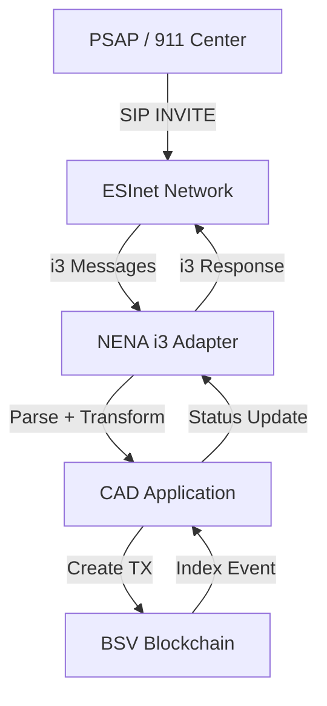

# NENA i3 Protocol Integration Plan

**Status**: 🔄 Planning Phase  
**Priority**: P1 (Critical for 911 Interoperability)  
**Timeline**: 2-3 weeks  
**Updated**: 2025-11-14 04:08 UTC

---

## 📋 Overview

NENA i3 (National Emergency Number Association Interface 3) is the standard protocol for Next Generation 911 (NG911) systems in North America. Integration is critical for CAD system interoperability with PSAP (Public Safety Answering Point) infrastructure.

---

## 🎯 Integration Goals

1. **Receive 911 Calls** from NENA i3 ESInet (Emergency Services IP Network)
2. **Parse PIDF-LO** (Presence Information Data Format - Location Object) for caller location
3. **Convert to Blockchain Events** - Create BSV transactions for incoming calls
4. **Bidirectional Updates** - Push CAD incident status back to PSAP
5. **Maintain Compliance** - Adhere to NENA-STA-010.2 standard

---

## 🏗️ Architecture



---

## 📦 Components to Implement

### 1. NENA i3 Adapter Service (src/adapters/nena-i3/)

**Files**:
- `I3Server.ts` - HTTP/SIP server for i3 messages
- `I3MessageParser.ts` - Parse PIDF-LO, APCO codes, call data
- `I3ResponseBuilder.ts` - Build i3-compliant responses
- `I3ToBlockchain.ts` - Convert i3 → blockchain event
- `BlockchainToI3.ts` - Convert blockchain event → i3 update

**Message Types to Support**:
1. **callStart** - Initial 911 call (SIP INVITE)
2. **callUpdate** - Call information update
3. **callEnd** - Call termination
4. **locationUpdate** - Rebid/updated location

### 2. PIDF-LO Parser (src/adapters/nena-i3/pidf-lo/)

**Responsibilities**:
- Parse XML-based PIDF-LO documents
- Extract geographic coordinates (lat/lng)
- Parse civic addresses (street, city, state, zip)
- Extract confidence/accuracy radius
- Handle multiple location formats (GPS, cell tower, civic)

**Example PIDF-LO**:
```xml
<?xml version="1.0" encoding="UTF-8"?>
<presence xmlns="urn:ietf:params:xml:ns:pidf">
  <tuple id="call-123">
    <status>
      <geopriv>
        <location-info>
          <Point xmlns="http://www.opengis.net/gml">
            <pos>25.6866 -100.3161</pos>
          </Point>
        </location-info>
      </geopriv>
    </status>
  </tuple>
</presence>
```

### 3. APCO Code Mapper (src/adapters/nena-i3/apco/)

**APCO Event Codes** (Association of Public-Safety Communications Officials):
- `911-MEDICAL` → Priority HIGH, Type MEDICAL
- `911-FIRE` → Priority CRITICAL, Type FIRE
- `911-POLICE` → Priority HIGH, Type LAW_ENFORCEMENT
- `911-UNKNOWN` → Priority MEDIUM, Type UNKNOWN

**Mapping**:
```typescript
interface APCOMapping {
  code: string;           // APCO code
  priority: Priority;     // CAD priority
  incidentType: string;   // Incident classification
  requiredResources: ResourceType[];
  defaultUnits: number;   // Auto-dispatch units
}
```

### 4. SIP/HTTP Server (src/adapters/nena-i3/server/)

**Endpoints**:
- `POST /i3/v1/callStart` - Receive new 911 call
- `POST /i3/v1/callUpdate` - Update call information
- `POST /i3/v1/callEnd` - Call ended
- `POST /i3/v1/locationUpdate` - Location rebid
- `GET /i3/v1/status` - Service health
- `GET /i3/v1/version` - Protocol version (3.0)

**Authentication**:
- TLS mutual authentication (X.509 certificates)
- HMAC signature verification
- IP whitelist (ESInet gateways only)

---

## 🔄 Workflow: 911 Call → Blockchain

### Step 1: Receive i3 callStart
```json
{
  "callId": "uuid-123-456",
  "callerNumber": "+15551234567",
  "callerLocation": {
    "latitude": 25.6866,
    "longitude": -100.3161,
    "accuracy": 50,
    "civicAddress": "123 Main St, Monterrey, NL"
  },
  "eventCode": "911-MEDICAL",
  "timestamp": "2025-11-14T04:00:00Z"
}
```

### Step 2: Parse & Transform
```typescript
const incident = {
  type: 'INCIDENT_CREATED',
  priority: 'HIGH',
  reason: 'MEDICAL_EMERGENCY',
  description: '911 Call - Medical emergency',
  location: {
    lat: 25.6866,
    lng: -100.3161,
    accuracy: 50,
    address: '123 Main St, Monterrey, NL'
  },
  origin: 'NENA_I3',
  callerInfo: {
    phone: '+15551234567',
    callId: 'uuid-123-456'
  },
  timestamp: 1731553200000
};
```

### Step 3: Create Blockchain Transaction
```typescript
const tx = await wallet.createTransaction({
  outputs: [{
    satoshis: 1,
    script: Script.buildSafeDataOut([
      Buffer.from(JSON.stringify({
        protocol: 'CAD',
        version: 1,
        type: 'INCIDENT_CREATED',
        data: incident
      }))
    ])
  }]
});

await tx.broadcast();
```

### Step 4: Respond to PSAP
```json
{
  "status": "ACCEPTED",
  "incidentId": "incident_1731553200000",
  "txid": "abc123...def456",
  "dispatchedUnits": ["UNIT-101", "UNIT-102"],
  "eta": 5
}
```

---

## 🧪 Testing Strategy

### Phase 1: Unit Tests
```typescript
describe('NENA i3 Adapter', () => {
  it('should parse callStart message', async () => {
    const message = loadFixture('callStart.json');
    const result = parser.parseCallStart(message);
    expect(result.priority).toBe('HIGH');
  });

  it('should parse PIDF-LO location', () => {
    const pidflo = loadFixture('pidf-lo.xml');
    const location = parser.parseLocation(pidflo);
    expect(location.lat).toBeCloseTo(25.6866);
  });
});
```

### Phase 2: Integration Tests
- Mock ESInet simulator (send fake i3 messages)
- Verify blockchain transactions created
- Validate response format compliance

### Phase 3: Compliance Testing
- NENA i3 protocol validator (external tool)
- Interoperability testing with real PSAP systems
- Performance: 100+ concurrent calls

---

## 📊 Performance Requirements

| Metric | Target | Critical |
|--------|--------|----------|
| **Call Processing Time** | <500ms | <1000ms |
| **Blockchain TX Creation** | <2s | <5s |
| **Concurrent Calls** | 100+ | 50+ |
| **Location Accuracy** | ±50m | ±100m |
| **Message Loss Rate** | <0.1% | <1% |
| **Uptime** | 99.99% | 99.9% |

---

## 🔐 Security Considerations

1. **TLS Mutual Auth** - Both client and server certificates
2. **IP Whitelisting** - Only accept from known ESInet gateways
3. **Message Signing** - HMAC-SHA256 signatures
4. **Rate Limiting** - Prevent DoS attacks
5. **Input Validation** - Strict schema validation
6. **Audit Logging** - All i3 messages logged to blockchain

---

## 📝 Implementation Checklist

### Week 1: Foundation
- [ ] Create I3Server.ts with HTTP endpoints
- [ ] Implement PIDF-LO parser (XML)
- [ ] Create message fixtures (test data)
- [ ] Unit tests for parser (20+ cases)
- [ ] Docker container for i3-adapter service

### Week 2: Integration
- [ ] Blockchain transaction creation from i3 events
- [ ] Response builder (i3-compliant JSON)
- [ ] APCO code mapper
- [ ] Integration tests with mock ESInet
- [ ] Geographic routing (assign nearest units)

### Week 3: Production Readiness
- [ ] TLS certificate configuration
- [ ] Performance testing (100+ concurrent)
- [ ] NENA compliance validation
- [ ] Documentation (API spec, deployment)
- [ ] Monitoring (Prometheus metrics)

---

## 🚀 Deployment

### Container Architecture
```
┌─────────────────────────────────────────┐
│           cad-i3-adapter                │
│  ┌────────────────────────────────┐    │
│  │   I3Server (port 5000)         │    │
│  │   - POST /i3/v1/callStart      │    │
│  │   - POST /i3/v1/callUpdate     │    │
│  │   - POST /i3/v1/callEnd        │    │
│  └────────┬───────────────────────┘    │
│           │                             │
│           ▼                             │
│  ┌────────────────────────────────┐    │
│  │   Blockchain Writer            │    │
│  │   - Create BSV transactions    │    │
│  └────────────────────────────────┘    │
└─────────────────┬───────────────────────┘
                  │
                  ▼
          BSV Testnet (api.whatsonchain.com)
```

### Environment Variables
```env
I3_ADAPTER_PORT=5000
I3_PROTOCOL_VERSION=3.0
I3_TLS_CERT_PATH=/certs/server.crt
I3_TLS_KEY_PATH=/certs/server.key
I3_ALLOWED_IPS=10.0.0.0/8,192.168.0.0/16
BSV_WALLET_XPRIV=<testnet_wallet>
BSV_API_URL=https://api.whatsonchain.com/v1/bsv/test
```

---

## 📚 References

1. **NENA-STA-010.2** - i3 Standard for Next Generation 9-1-1
2. **RFC 4119** - A Presence-based GEOPRIV Location Object Format (PIDF-LO)
3. **RFC 3261** - SIP: Session Initiation Protocol
4. **APCO P33** - Public Safety Communications Codes

---

**Next Actions**:
1. Implement I3Server.ts skeleton
2. Create PIDF-LO parser with XML support
3. Set up test fixtures (sample i3 messages)
4. Write unit tests for core parsing logic
5. Deploy as 5th container in Docker stack

**Waiting For**:
- User notification when testnet tokens are ready
- Real PSAP connection details (if available for testing)
