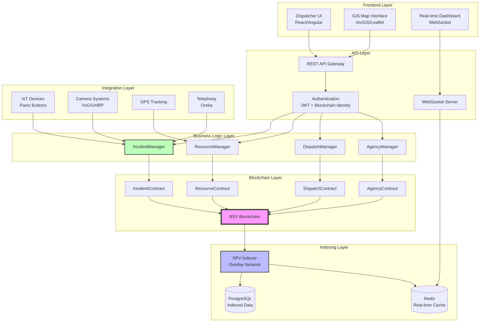
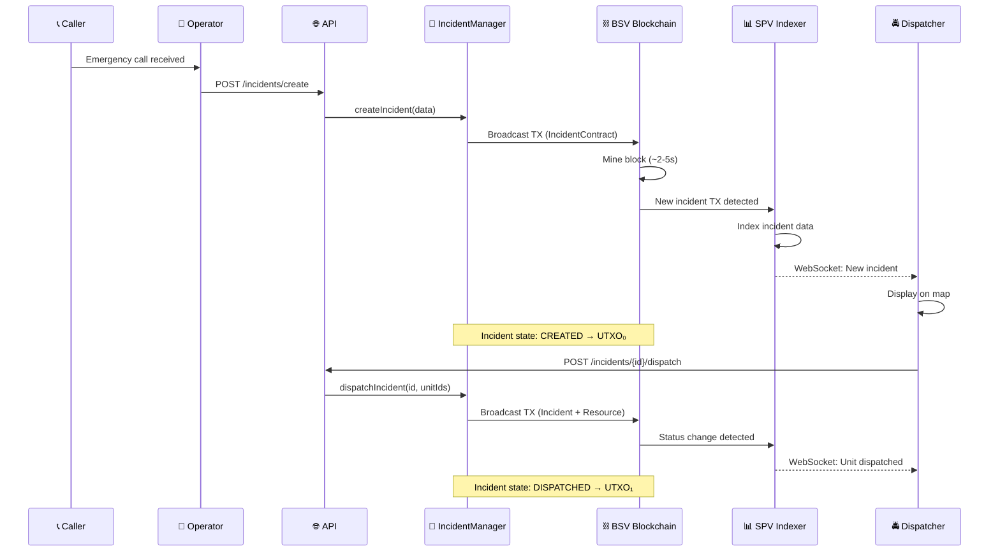

# Sistema CAD (Computer-Aided Dispatch) en Blockchain BSV

## Índice de documentación

### 📚 Documentos de diseño
- [01 - Estándares de la industria](./01-industry-standards.md) - NENA i3, APCO, PSAP
- [02 - Event sourcing en blockchain](./02-event-sourcing-design.md) - Diseño UTXO y contratos sCrypt
- [README-functions](./readme-functions.md) - Mapeo completo de funciones con Mermaid
- [README-test-scenarios](./readme-test-scenarios.md) - Escenarios de prueba realistas

### 🏗️ Arquitectura

## Arquitectura general

### Capas del sistema

**1. Frontend Layer**
- Interfaz de despachador (React/Angular)
- Visualización GIS en tiempo real
- Dashboard con métricas en vivo

**2. API Layer**
- REST API para operaciones CRUD
- WebSocket para notificaciones push
- Autenticación basada en blockchain + JWT

**3. Business Logic Layer**
- **IncidentManager**: Gestión de ciclo de vida de incidentes
- **ResourceManager**: Gestión de unidades y recursos
- **DispatchManager**: Lógica de asignación automática
- **AgencyManager**: Interoperabilidad multi-agencia

**4. Blockchain Layer (BSV)**
- **IncidentContract**: Estados y transiciones de incidentes
- **ResourceContract**: Estados de recursos/unidades
- **DispatchContract**: Asignaciones y liberaciones
- **AgencyContract**: Permisos cross-jurisdicción

**5. Indexing Layer**
- **SPV Indexer**: Overlay network para queries rápidas
- **PostgreSQL**: Datos indexados para búsquedas complejas
- **Redis**: Cache en tiempo real para dashboard

**6. Integration Layer**
- **IoT Devices**: Botones de pánico, sensores
- **Camera Systems**: Integración VxG + UHRP
- **GPS Tracking**: Rastreo de unidades en tiempo real
- **Telephony**: Grabación de llamadas con Oreka

## Flujo de datos principal

## Comparación: Legacy vs Blockchain

| Aspecto | Sistema Legacy | Sistema Blockchain |
|---------|---------------|-------------------|
| **Base de datos** | PostgreSQL centralizada | BSV Blockchain distribuida |
| **Event sourcing** | Kafka (externo) | UTXO nativo |
| **Auditoría** | EventLog tabla | Cadena de TXs inmutable |
| **Interoperabilidad** | API REST custom | Contratos sCrypt multi-sig |
| **Escalabilidad** | Vertical (más RAM/CPU) | Horizontal (más nodos) |
| **Costos** | Servidores 24/7 (~$5k/mes) | Fees de TX (~$50/mes) |
| **Resiliencia** | SPOF (Single Point of Failure) | Sin SPOF (red P2P) |
| **Latencia write** | ~50ms | ~2-5s |
| **Latencia read** | ~10ms | ~10ms (indexer) |

## Ventajas del enfoque blockchain

### 1. Inmutabilidad y auditoría
- Cada acción queda registrada permanentemente en blockchain
- Cadena de custodia para evidencia legal
- No se pueden alterar registros históricos

### 2. Interoperabilidad nativa
- Agencias comparten incidentes mediante contratos multi-firma
- No requiere integración API custom por agencia
- Permisos granulares en el contrato

### 3. Reducción de costos
- Sin servidores centralizados 24/7
- Fees de transacción: ~$0.0001 USD por operación
- Storage en blockchain: más barato que S3 a largo plazo

### 4. Escalabilidad ilimitada
- BSV puede procesar >50,000 TPS
- Sin límites de almacenamiento (bloques ilimitados)
- Indexers se pueden replicar horizontalmente

### 5. Resiliencia
- Red P2P: sin punto único de falla
- Datos replicados en múltiples nodos
- Alta disponibilidad garantizada

## Métricas de performance esperadas

### Operaciones de incidente

| Operación | Latencia | Throughput | Costo |
|-----------|----------|------------|-------|
| Create incident | 2-6s | 1000/s | $0.0001 |
| Update incident | 2-6s | 1000/s | $0.0001 |
| Close incident | 2-6s | 1000/s | $0.0001 |
| Query incident | <100ms | 10000/s | $0 |

### Operaciones de recursos

| Operación | Latencia | Throughput | Costo |
|-----------|----------|------------|-------|
| Dispatch unit | 2-6s | 500/s | $0.0002 |
| Update GPS location | 2-6s | 5000/s | $0.0001 |
| Change unit status | 2-6s | 1000/s | $0.0001 |

### Escenario de carga alta

**1000 incidentes activos simultáneos:**
- Storage en blockchain: ~500 KB
- Costo total: ~$0.10 USD
- Queries indexadas: <100ms cada una
- Updates en tiempo real vía WebSocket

## Stack tecnológico

### Backend
- **Language**: TypeScript
- **Blockchain SDK**: BSV SDK v2
- **Smart Contracts**: sCrypt
- **API Framework**: Express.js / Fastify
- **WebSocket**: Socket.io / WS
- **Database**: PostgreSQL 16
- **Cache**: Redis 7

### Frontend
- **Framework**: React / Angular
- **GIS**: ArcGIS API / Leaflet
- **Real-time**: Socket.io client
- **State Management**: Redux / Zustand

### Infrastructure
- **Blockchain Node**: BSV Node v1.0.16
- **Indexer**: Custom SPV overlay
- **Container**: Docker + Kubernetes
- **CI/CD**: GitLab CI / GitHub Actions

## Roadmap de implementación

### Fase 1: Core (2 meses)
- [x] Diseño de arquitectura
- [x] Diseño de contratos sCrypt
- [ ] Implementación IncidentManager
- [ ] Implementación ResourceManager
- [ ] Tests unitarios + integración

### Fase 2: Indexing (1 mes)
- [ ] SPV Indexer overlay network
- [ ] PostgreSQL schema + migrations
- [ ] Redis cache layer
- [ ] WebSocket notifications

### Fase 3: Frontend (2 meses)
- [ ] Dispatcher UI
- [ ] GIS map integration
- [ ] Real-time dashboard
- [ ] Mobile app para unidades

### Fase 4: Integrations (1 mes)
- [ ] IoT panic buttons
- [ ] Camera systems (VxG + UHRP)
- [ ] GPS tracking
- [ ] Telephony (Oreka)

### Fase 5: Production (1 mes)
- [ ] Load testing (10K incidents)
- [ ] Security audit
- [ ] Documentation completa
- [ ] Training material
- [ ] Deployment a producción

## Próximos pasos

1. Revisar [README-functions.md](./readme-functions.md) para mapeo detallado de funciones
2. Revisar [README-test-scenarios.md](./readme-test-scenarios.md) para escenarios de prueba
3. Implementar contratos sCrypt en `/src/contracts/`
4. Implementar managers en `/src/managers/`
5. Crear tests en `/tests/`

---

**Autor**: Sistema de diseño CAD blockchain  
**Última actualización**: 2025-11-03  
**Versión**: 1.0.0
