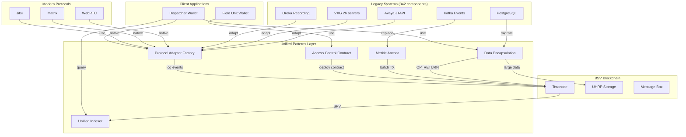

# Unified Patterns - BSV CAD Architecture

**Created**: 2025-11-03 00:15 CST  
**Parent**: `../../WARP.md`  
**Purpose**: Patrones unificados para migración Legacy → BSV

---

## 🎯 Filosofía: Una Función Para Gobernarlas A Todas

### Observación Crítica

Los **342 componentes legacy** (INVENTORY.md) hacen básicamente **3 cosas**:
1. **Capturar datos** (video, audio, location, incidents)
2. **Almacenar/indexar** esos datos
3. **Controlar acceso** a esos datos

**Solución BSV**: Patrones genéricos reutilizables en lugar de 342 servicios específicos.

---

## 📦 Patrón 1: Data Encapsulation Universal

### Concepto

**UN SOLO script** para encapsular CUALQUIER tipo de dato on-chain.

### Implementación

```typescript
// src/blockchain/encapsulation.ts
import { Transaction, Script, OP_RETURN, OP_FALSE } from '@bsv/sdk'
import { UHRPClient } from './uhrp'
import { sha256 } from './crypto'

export enum DataType {
  VIDEO = 'video',
  AUDIO = 'audio',
  IMAGE = 'image',
  INCIDENT = 'incident',
  LOCATION = 'location',
  CALL_RECORDING = 'call_recording',
  SENSOR_DATA = 'sensor_data',
  DOCUMENT = 'document'
}

export interface EncapsulatedData {
  type: DataType
  hash: string  // SHA256 of original data
  timestamp: number
  uhrpHash?: string  // If stored in UHRP
  metadata: Record<string, any>
}

export class UnifiedDataEncapsulation {
  constructor(
    private uhrp: UHRPClient,
    private wallet: HDWallet
  ) {}

  /**
   * Encapsulate ANY data type on-chain
   * @param data - Raw data (Buffer, string, object)
   * @param type - Data type enum
   * @param metadata - Additional metadata
   * @returns Transaction with OP_RETURN containing hash + pointer
   */
  async encapsulate(
    data: Buffer | string | object,
    type: DataType,
    metadata: Record<string, any> = {}
  ): Promise<{ tx: Transaction, payload: EncapsulatedData }> {
    
    // 1. Normalize data to Buffer
    const buffer = this.normalize(data)
    
    // 2. Compute hash
    const hash = sha256(buffer)
    
    // 3. Upload to UHRP (if large)
    let uhrpHash: string | undefined
    if (buffer.length > 10000) {  // >10KB
      const result = await this.uhrp.upload(buffer, {
        type: type.toString(),
        timestamp: Date.now(),
        ...metadata
      })
      uhrpHash = result.hash
    }
    
    // 4. Create payload
    const payload: EncapsulatedData = {
      type,
      hash,
      timestamp: Date.now(),
      uhrpHash,
      metadata
    }
    
    // 5. Create blockchain transaction with OP_RETURN
    const tx = await this.wallet.createTransaction({
      outputs: [
        {
          script: Script.fromASM([
            OP_FALSE,
            OP_RETURN,
            Buffer.from(JSON.stringify(payload))
          ].join(' ')),
          satoshis: 0
        }
      ]
    })
    
    return { tx, payload }
  }

  private normalize(data: Buffer | string | object): Buffer {
    if (Buffer.isBuffer(data)) return data
    if (typeof data === 'string') return Buffer.from(data)
    return Buffer.from(JSON.stringify(data))
  }
}
```

### Uso Universal

```typescript
// Encapsular VIDEO (VXG 26 servers → UHRP + blockchain)
const video = await fs.readFile('bodycam.mp4')
const { tx: videoTx } = await encapsulator.encapsulate(
  video,
  DataType.VIDEO,
  { officerId: 'did:bsv:officer123', incidentId: 'INC-2024-001' }
)

// Encapsular LLAMADA (Avaya/Oreka → UHRP + blockchain)
const callRecording = await downloadFromOreka(callId)
const { tx: callTx } = await encapsulator.encapsulate(
  callRecording,
  DataType.CALL_RECORDING,
  { callerId: '+521234567890', duration: 180, dispatcherId: 'DIS-456' }
)

// Encapsular INCIDENTE (PostgreSQL → blockchain)
const incident = { type: 'robbery', location: {...}, priority: 'high' }
const { tx: incidentTx } = await encapsulator.encapsulate(
  incident,
  DataType.INCIDENT,
  { reporterId: 'did:bsv:citizen789' }
)

// MISMO PATRÓN, DIFERENTES DATOS
```

---

## 🌳 Patrón 2: Merkle Anchoring Batch

### Concepto

**Batch N eventos** (de cualquier tipo) en UN SOLO transaction con Merkle root.

### Implementación

```typescript
// src/blockchain/merkle-anchor.ts
import { MerkleTree } from 'merkletreejs'
import { sha256 } from './crypto'

export interface AnchorableEvent {
  id: string
  type: DataType
  data: any
  timestamp: number
}

export class UnifiedMerkleAnchor {
  constructor(private wallet: HDWallet) {}

  /**
   * Anchor multiple events (any type) in single TX
   * @param events - Array of events to anchor
   * @returns Merkle root + transaction + proofs
   */
  async anchor(events: AnchorableEvent[]): Promise<{
    root: string,
    tx: Transaction,
    proofs: Map<string, string[]>  // eventId → merkle proof
  }> {
    
    // 1. Create leaves (hash each event)
    const leaves = events.map(e => {
      const serialized = JSON.stringify({
        id: e.id,
        type: e.type,
        data: e.data,
        timestamp: e.timestamp
      })
      return sha256(Buffer.from(serialized))
    })
    
    // 2. Build Merkle tree
    const tree = new MerkleTree(leaves, sha256, { sortPairs: true })
    const root = tree.getRoot().toString('hex')
    
    // 3. Create blockchain TX with root
    const tx = await this.wallet.createTransaction({
      data: {
        type: 'merkle_anchor',
        root,
        count: events.length,
        types: events.map(e => e.type),
        timestamp: Date.now()
      }
    })
    
    // 4. Generate merkle proofs for each event
    const proofs = new Map<string, string[]>()
    events.forEach((event, index) => {
      const proof = tree.getProof(leaves[index]).map(p => p.data.toString('hex'))
      proofs.set(event.id, proof)
    })
    
    return { root, tx, proofs }
  }

  /**
   * Verify an event is in the anchored batch
   */
  verifyInclusion(
    eventId: string,
    eventData: any,
    proof: string[],
    root: string
  ): boolean {
    const leaf = sha256(Buffer.from(JSON.stringify(eventData)))
    const tree = new MerkleTree([], sha256, { sortPairs: true })
    return tree.verify(proof.map(p => Buffer.from(p, 'hex')), leaf, Buffer.from(root, 'hex'))
  }
}
```

### Uso: Batch IoT Events

```typescript
// 25,000 IoT devices → 1 transaction cada 10 segundos
const anchor = new UnifiedMerkleAnchor(wallet)

// Buffer de eventos
const buffer: AnchorableEvent[] = []

// Cada dispositivo agrega eventos
bodyCamera.on('frame', (frame) => {
  buffer.push({
    id: `cam-${deviceId}-${Date.now()}`,
    type: DataType.VIDEO,
    data: frame,
    timestamp: Date.now()
  })
})

gpsTracker.on('location', (coords) => {
  buffer.push({
    id: `gps-${deviceId}-${Date.now()}`,
    type: DataType.LOCATION,
    data: coords,
    timestamp: Date.now()
  })
})

// Cada 10s o 1000 eventos, anchor batch
setInterval(async () => {
  if (buffer.length > 0) {
    const batch = buffer.splice(0, 1000)
    const { root, tx, proofs } = await anchor.anchor(batch)
    
    console.log(`Anchored ${batch.length} events in TX ${tx.txid}`)
    console.log(`Merkle root: ${root}`)
    
    // Store proofs off-chain for SPV verification
    await storage.saveProofs(proofs)
  }
}, 10000)
```

**Costo**: 1 TX para 1000 eventos = 1 sat = $0.00001

---

## 🔐 Patrón 3: Unified Access Control

### Concepto

**UN contrato sCrypt** reutilizable para controlar acceso a CUALQUIER recurso.

### Implementación

```typescript
// src/contracts/UnifiedAccessControl.ts
import { SmartContract, method, prop, Sha256, PubKey, Sig, assert } from 'scrypt-ts'

export class UnifiedAccessControl extends SmartContract {
  @prop()
  resourceHash: Sha256  // Hash of resource (video, document, incident, etc)
  
  @prop()
  resourceType: ByteString  // 'video' | 'call_recording' | 'incident'
  
  @prop()
  requiredSignatures: bigint  // e.g. 3 for 3-of-5 multisig
  
  @prop()
  authorizedPubkeys: FixedArray<PubKey, 5>  // Max 5 authorized parties
  
  @prop()
  expirationTimestamp: bigint  // Optional: auto-unlock after time
  
  @method()
  public unlock(sigs: FixedArray<Sig, 3>): boolean {
    // Verify we have enough signatures
    assert(BigInt(sigs.length) >= this.requiredSignatures, 'Insufficient signatures')
    
    // Verify each signature is from authorized pubkey
    let validSigs = 0n
    for (let i = 0; i < sigs.length; i++) {
      for (let j = 0; j < this.authorizedPubkeys.length; j++) {
        if (this.checkSig(sigs[i], this.authorizedPubkeys[j])) {
          validSigs++
          break
        }
      }
    }
    
    assert(validSigs >= this.requiredSignatures, 'Invalid signatures')
    return true
  }
  
  @method()
  public timeUnlock(): boolean {
    // Auto-unlock after expiration (e.g. 30 days for FOIA requests)
    assert(this.ctx.locktime >= this.expirationTimestamp, 'Not expired yet')
    return true
  }
}
```

### Uso: Evidence Vault

```typescript
// Deploy contract para evidencia de alto perfil
const evidenceContract = new UnifiedAccessControl(
  sha256(videoEvidence),  // Hash del video
  toByteString('video'),  // Tipo
  3n,  // Requiere 3 firmas
  [
    supervisorPubkey,
    chiefPubkey,
    districtAttorneyPubkey,
    judgePubkey,
    internalAffairsPubkey
  ],
  BigInt(Date.now() + 30 * 24 * 60 * 60 * 1000)  // Expira en 30 días
)

const deployTx = await evidenceContract.deploy(1000)  // Deploy con 1000 sats

// Para acceder:
// Opción 1: 3-of-5 multisig (supervisor + chief + DA)
const unlockTx1 = await evidenceContract.methods.unlock([
  await supervisor.sign(...),
  await chief.sign(...),
  await da.sign(...)
])

// Opción 2: Esperar 30 días (FOIA request)
await sleep(30 * 24 * 60 * 60 * 1000)
const unlockTx2 = await evidenceContract.methods.timeUnlock()
```

**Reusabilidad**: MISMO contrato para:
- Videos de body cameras
- Grabaciones de llamadas
- Documentos de investigación
- Incidentes clasificados
- Datos de testigos protegidos

---

## 🔄 Patrón 4: Protocol Adapter Factory

### Concepto

**Factory pattern** para crear adapters dinámicamente según protocolo detectado.

### Implementación

```typescript
// src/adapters/ProtocolAdapterFactory.ts
export enum Protocol {
  WEBRTC = 'webrtc',
  SIP_TLS = 'sip-tls',
  AVAYA_JTAPI = 'avaya-jtapi',
  VXG_VIDEO = 'vxg-video',
  MATRIX = 'matrix',
  WEBSOCKET_REDIS = 'websocket-redis'
}

export interface ProtocolAdapter {
  protocol: Protocol
  capabilities: string[]
  connect(config: any): Promise<void>
  send(data: any): Promise<void>
  receive(): AsyncIterator<any>
  logToBlockchain(event: any): Promise<Transaction>
}

export class ProtocolAdapterFactory {
  private adapters = new Map<Protocol, () => ProtocolAdapter>()
  
  constructor(private blockchain: BlockchainLogger) {
    // Register all adapters
    this.register(Protocol.WEBRTC, () => new WebRTCAdapter(blockchain))
    this.register(Protocol.AVAYA_JTAPI, () => new AvayaAdapter(blockchain))
    this.register(Protocol.VXG_VIDEO, () => new VXGAdapter(blockchain))
    // ... register others
  }
  
  register(protocol: Protocol, factory: () => ProtocolAdapter) {
    this.adapters.set(protocol, factory)
  }
  
  create(protocol: Protocol): ProtocolAdapter {
    const factory = this.adapters.get(protocol)
    if (!factory) throw new Error(`Unknown protocol: ${protocol}`)
    return factory()
  }
  
  /**
   * Auto-detect best protocol for communication
   */
  async negotiate(capabilities: Protocol[]): Promise<ProtocolAdapter> {
    // Priority: Modern > Legacy
    const priority = [
      Protocol.WEBRTC,
      Protocol.MATRIX,
      Protocol.SIP_TLS,
      Protocol.AVAYA_JTAPI,
      Protocol.WEBSOCKET_REDIS
    ]
    
    for (const proto of priority) {
      if (capabilities.includes(proto)) {
        return this.create(proto)
      }
    }
    
    throw new Error('No compatible protocol found')
  }
}
```

### Uso: Llamada con Fallback Automático

```typescript
const factory = new ProtocolAdapterFactory(blockchainLogger)

// Intento de llamada entre dispatcher y field unit
async function makeCall(from: DID, to: DID) {
  // Query capabilities del destinatario
  const toCapabilities = await queryCapabilities(to)
  
  // Auto-negotiate mejor protocolo
  const adapter = await factory.negotiate(toCapabilities)
  
  console.log(`Using protocol: ${adapter.protocol}`)
  
  // Connect
  await adapter.connect({ from, to })
  
  // Send audio
  const stream = await getUserMedia()
  await adapter.send(stream)
  
  // LOG TO BLOCKCHAIN (always, regardless of protocol)
  await adapter.logToBlockchain({
    type: 'call_initiated',
    from,
    to,
    protocol: adapter.protocol,
    timestamp: Date.now()
  })
}
```

---

## 🗂️ Patrón 5: Unified Indexer

### Concepto

**UN SOLO indexer** que procesa CUALQUIER tipo de blockchain event.

### Implementación

```typescript
// src/indexer/UnifiedIndexer.ts
export interface IndexedEvent {
  txid: string
  type: DataType
  data: EncapsulatedData
  timestamp: number
  blockHeight: number
}

export class UnifiedIndexer {
  private db: Database
  
  constructor(
    private spvClient: SPVClient,
    database: Database
  ) {
    this.db = database
  }
  
  /**
   * Index ALL blockchain events (any type)
   */
  async start() {
    // Subscribe to SPV events
    this.spvClient.on('transaction', async (tx) => {
      await this.processTransaction(tx)
    })
  }
  
  private async processTransaction(tx: Transaction) {
    // Extract OP_RETURN data
    const opReturnOutput = tx.outputs.find(o => o.script.isDataOut())
    if (!opReturnOutput) return
    
    // Parse encapsulated data
    const payload: EncapsulatedData = JSON.parse(opReturnOutput.script.getData())
    
    // Index based on type
    switch (payload.type) {
      case DataType.VIDEO:
        await this.indexVideo(tx.txid, payload)
        break
      case DataType.CALL_RECORDING:
        await this.indexCallRecording(tx.txid, payload)
        break
      case DataType.INCIDENT:
        await this.indexIncident(tx.txid, payload)
        break
      case DataType.LOCATION:
        await this.indexLocation(tx.txid, payload)
        break
      // ... handle all types
    }
  }
  
  private async indexVideo(txid: string, payload: EncapsulatedData) {
    await this.db.videos.insert({
      txid,
      hash: payload.hash,
      uhrpHash: payload.uhrpHash,
      timestamp: payload.timestamp,
      officerId: payload.metadata.officerId,
      incidentId: payload.metadata.incidentId
    })
  }
  
  // Similar for other types...
  
  /**
   * Query API (unified interface)
   */
  async query(filters: {
    type?: DataType,
    from?: Date,
    to?: Date,
    metadata?: Record<string, any>
  }): Promise<IndexedEvent[]> {
    return this.db.events.find(filters)
  }
}
```

### Uso: Query Across All Data Types

```typescript
const indexer = new UnifiedIndexer(spvClient, database)
await indexer.start()

// Query all events for an incident (videos + calls + locations)
const incidentEvents = await indexer.query({
  metadata: { incidentId: 'INC-2024-001' }
})

// Returns:
// [
//   { type: 'video', txid: 'abc...', data: {...} },
//   { type: 'call_recording', txid: 'def...', data: {...} },
//   { type: 'location', txid: 'ghi...', data: {...} }
// ]

// Query by time range (any type)
const last24Hours = await indexer.query({
  from: new Date(Date.now() - 24 * 60 * 60 * 1000),
  to: new Date()
})
```

---

## 📐 Arquitectura Completa



---

## ✅ Conclusión

### Lo que logramos

1. **342 componentes** → **5 patrones reutilizables**
2. **50+ microservicios** → **1 UnifiedDataEncapsulation**
3. **26 servidores video** → **1 UHRPClient + Merkle**
4. **6 HAProxy** → **1 ProtocolAdapterFactory**
5. **PostgreSQL mutable** → **1 UnifiedIndexer (immutable)**

### Próximos pasos

- [ ] Implementar cada patrón en `/src/patterns/`
- [ ] Testing unitario con 1000 eventos simulados
- [ ] Benchmark: Legacy vs BSV (TPS, costo, latencia)
- [ ] POC end-to-end: Incident → Video → Access Control

**Status**: ✅ Architecture Complete  
**Next**: Implementation Phase
